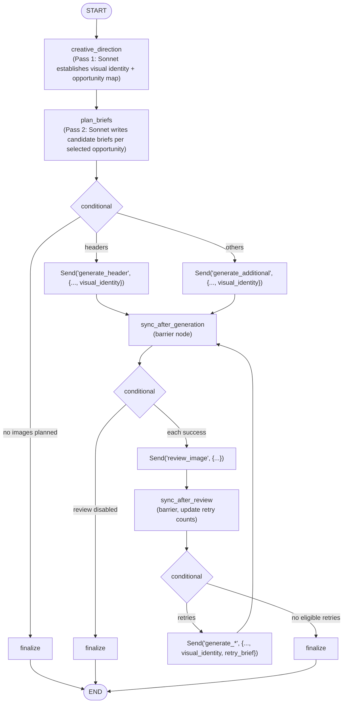
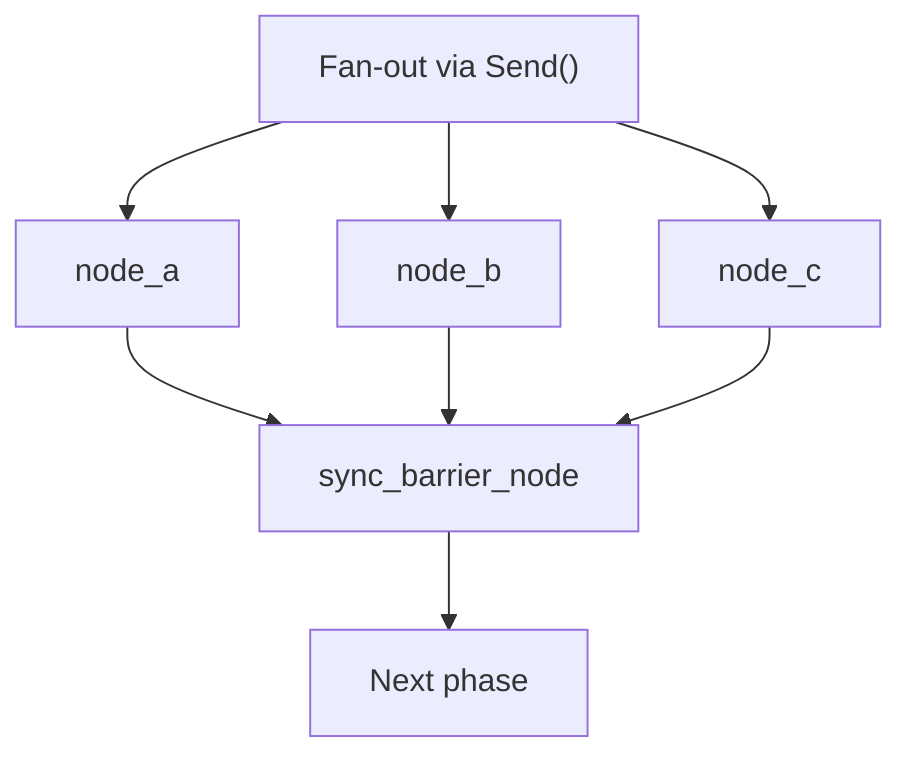
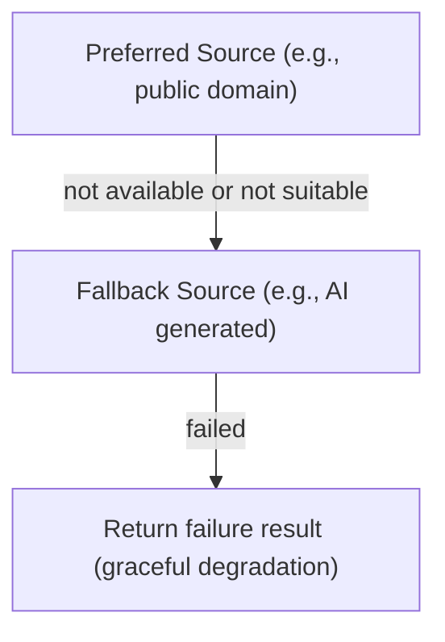

# Document Illustration with Multi-Source Generation

## Intent

Create a workflow that intelligently illustrates markdown documents using multiple image sources (public domain, AI-generated, SVG diagrams) with parallel generation, vision-based review, and conditional retry loops.

## Problem

Document illustration workflows face several challenges:

1. **Multiple image sources** with different APIs, quality characteristics, and costs
2. **Parallel generation** needed for performance but requires careful state aggregation
3. **Quality control** needs vision-based assessment with retry capability
4. **Different image types** require specialized handling (diagrams need refinement loops)
5. **Graceful degradation** when preferred sources fail
6. **Diagram engine selection**—different diagram types suit different renderers (Mermaid, Graphviz, raw SVG)
7. **Image search quality**—single queries miss relevant results; multi-query pools with LLM selection improve coverage
8. **AI image quality**—unstructured prompts to Imagen produce inconsistent results

## Solution

A LangGraph workflow with:
- **Two-pass planning**—creative direction (visual identity) followed by brief writing, replacing a single monolithic analysis call
- **Fan-out/fan-in** using `Send()` for parallel image generation
- **Visual identity propagation**—palette, mood, style flow from planning into every generation prompt
- **Sync barrier nodes** for coordination between phases
- **Vision review** with structured output for quality assessment
- **Conditional retry loop** for failed images within the same graph
- **Nested refinement loop** (outside main graph) for SVG diagram quality
- **Diagram engine routing**—subtype-based routing to Mermaid, Graphviz, or raw SVG with fallback chain
- **Multi-query image search**—literal plus conceptual queries pooled and deduplicated
- **Structured Imagen prompts**—Pydantic schema converts briefs into front-loaded Imagen prompts
- **Vision pair comparison**—tournament-style selection for both Imagen candidates and diagram candidates

### Workflow Architecture



## Implementation

### State Definition with Reducers

The critical pattern: **every field written by parallel branches needs a reducer**.

```python
# workflows/output/illustrate/state.py

from operator import add
from typing import Annotated, Literal
from typing_extensions import TypedDict


def merge_dicts(left: dict, right: dict) -> dict:
    """Reducer that merges dictionaries from parallel nodes."""
    result = dict(left) if left else {}
    if right:
        result.update(right)
    return result


class IllustrateState(TypedDict, total=False):
    """Main workflow state for document illustration.

    Uses Annotated[list[...], add] for parallel aggregation of results
    from nodes invoked via Send().
    """

    # Input (no reducer needed - set once at start)
    input: IllustrateInput
    config: IllustrateConfig

    # Analysis phase (no reducer - single node writes)
    extracted_title: str
    image_plan: list[ImageLocationPlan]  # Backward compat: populated from candidate_briefs

    # Creative direction (Pass 1 — single node writes)
    visual_identity: VisualIdentity
    image_opportunities: list[ImageOpportunity]
    editorial_notes: str

    # Candidate briefs (Pass 2 — retained for LangSmith observability)
    candidate_briefs: list[CandidateBrief]

    # Generation phase - PARALLEL writes require reducers
    generation_results: Annotated[list[ImageGenResult], add]

    # Review phase - PARALLEL writes require reducers
    review_results: Annotated[list[ImageReviewResult], add]

    # Retry tracking - PARALLEL writes require reducers
    retry_count: Annotated[dict[str, int], merge_dicts]
    pending_retries: Annotated[list[str], add]
    retry_briefs: Annotated[dict[str, str], merge_dicts]

    # Final output (single node writes)
    final_images: list[FinalImage]
    illustrated_document: str

    # Workflow metadata - PARALLEL writes require reducers
    errors: Annotated[list[WorkflowError], add]
    status: Literal["success", "partial", "failed"]
```

**Key insight**: The `merge_dicts` reducer handles dictionary fields like `retry_count` and `retry_briefs` that multiple parallel nodes might update. The new Pass 1 and Pass 2 fields (`visual_identity`, `image_opportunities`, `editorial_notes`, `candidate_briefs`) don't need reducers because they're written by single sequential nodes.

### Fan-Out with Send() and Visual Identity

Route to parallel generation nodes, propagating visual identity from planning:

```python
# workflows/output/illustrate/graph.py

from langgraph.types import Send


def route_after_analysis(state: IllustrateState) -> list[Send] | str:
    """Route to generation after analysis.

    If analysis failed or no images planned, go to finalize.
    Otherwise, fan out to generate nodes with visual identity context.
    """
    if state.get("status") == "failed":
        return "finalize"

    image_plan = state.get("image_plan", [])
    if not image_plan:
        return "finalize"

    config = state.get("config") or IllustrateConfig()
    document = state["input"]["markdown_document"]
    visual_identity = state.get("visual_identity")

    sends = []

    for plan in image_plan:
        send_data = {
            "location": plan,
            "document_context": document,
            "config": config,
            "visual_identity": visual_identity,  # From Pass 1
        }

        if plan.purpose == "header":
            sends.append(Send("generate_header", send_data))
        else:
            sends.append(Send("generate_additional", send_data))

    return sends
```

**Pattern**: Conditional edges can return either:
- A string (single node name)
- A list of `Send()` objects for parallel execution

**Key change**: The `visual_identity` from Pass 1 is propagated through `Send()` data to every generation node, ensuring consistent style across all parallel branches.

### Sync Barrier Nodes

Empty nodes that act as synchronization points:

```python
def sync_after_generation(state: IllustrateState) -> dict:
    """Synchronization barrier after all generations complete."""
    generation_results = state.get("generation_results", [])
    successful = sum(1 for r in generation_results if r["success"])
    logger.info(
        f"Generation sync: {successful}/{len(generation_results)} successful"
    )
    return {}  # No state changes, just synchronization


def sync_after_review(state: IllustrateState) -> dict:
    """Synchronization barrier and retry preparation after review.

    Updates retry_count for any pending retries.
    """
    pending_retries = state.get("pending_retries", [])
    retry_count = dict(state.get("retry_count", {}))

    for loc_id in pending_retries:
        retry_count[loc_id] = retry_count.get(loc_id, 0) + 1

    return {"retry_count": retry_count}
```

**Pattern**: Barrier nodes ensure all parallel branches complete before proceeding. They can also perform aggregation logic.

### Conditional Retry Loop

Route back to generation for failed images, preserving visual identity:

```python
def route_after_review(state: IllustrateState) -> list[Send] | str:
    """Route to retry generation or finalize."""
    config = state.get("config") or IllustrateConfig()
    pending_retries = state.get("pending_retries", [])
    retry_count = state.get("retry_count", {})
    retry_briefs = state.get("retry_briefs", {})
    image_plan = state.get("image_plan", [])
    document = state["input"]["markdown_document"]
    visual_identity = state.get("visual_identity")

    eligible_retries = [
        loc_id for loc_id in pending_retries
        if retry_count.get(loc_id, 0) <= config.max_retries
    ]

    if not eligible_retries:
        return "finalize"

    sends = []
    for loc_id in eligible_retries:
        plan = _find_plan_by_id(image_plan, loc_id)
        if not plan:
            continue

        send_data = {
            "location": plan,
            "document_context": document,
            "config": config,
            "visual_identity": visual_identity,  # Maintained across retries
            "is_retry": True,
            "retry_brief": retry_briefs.get(loc_id),  # Vision feedback
        }

        if plan.purpose == "header":
            sends.append(Send("generate_header", send_data))
        else:
            sends.append(Send("generate_additional", send_data))

    return sends if sends else "finalize"
```

**Key insight**: The same generation nodes are reused for retries. The `retry_brief` contains vision model feedback for improved generation. The `visual_identity` is preserved across retries to maintain style consistency.

### Graph Construction

Wire up nodes with two-pass planning and proper edge routing:

```python
def create_illustrate_graph() -> StateGraph:
    """Create the illustrate workflow graph."""
    builder = StateGraph(IllustrateState)

    # Add nodes — two-pass planning + generation/review/finalize
    builder.add_node("creative_direction", creative_direction_node)
    builder.add_node("plan_briefs", plan_briefs_node)
    builder.add_node("generate_header", generate_header_node)
    builder.add_node("generate_additional", generate_additional_node)
    builder.add_node("sync_after_generation", sync_after_generation)
    builder.add_node("review_image", review_image_node)
    builder.add_node("sync_after_review", sync_after_review)
    builder.add_node("finalize", finalize_node)

    # Two-pass planning: creative_direction → plan_briefs
    builder.add_edge(START, "creative_direction")
    builder.add_edge("creative_direction", "plan_briefs")

    # After plan_briefs, fan out to generation
    builder.add_conditional_edges(
        "plan_briefs",
        route_after_analysis,
        ["generate_header", "generate_additional", "finalize"],
    )

    # All generation nodes converge to sync
    builder.add_edge("generate_header", "sync_after_generation")
    builder.add_edge("generate_additional", "sync_after_generation")

    # After generation sync, route to review or finalize
    builder.add_conditional_edges(
        "sync_after_generation",
        route_to_review,
        ["review_image", "finalize"],
    )

    # All review nodes converge to sync
    builder.add_edge("review_image", "sync_after_review")

    # After review sync, route to retry or finalize
    builder.add_conditional_edges(
        "sync_after_review",
        route_after_review,
        ["generate_header", "generate_additional", "finalize"],
    )

    # Finalize to end
    builder.add_edge("finalize", END)

    return builder.compile()
```

### Diagram Engine Routing

The `generate_additional` node routes diagram generation to the best engine based on the planned diagram subtype:

```python
# workflows/output/illustrate/nodes/generate_additional.py

_MERMAID_SUBTYPES = {"flowchart", "sequence", "concept_map"}
_GRAPHVIZ_SUBTYPES = {"network_graph", "hierarchy", "dependency_tree"}

async def _generate_diagram(location_id, plan, brief, config):
    subtype = plan.diagram_subtype
    result = None

    # Try preferred engine based on subtype
    if subtype in _MERMAID_SUBTYPES and is_engine_available("mermaid"):
        result = await generate_mermaid_with_selection(
            analysis=brief, config=diagram_config, custom_instructions=brief,
        )
    elif subtype in _GRAPHVIZ_SUBTYPES and is_engine_available("graphviz"):
        result = await generate_graphviz_with_selection(
            analysis=brief, config=diagram_config, custom_instructions=brief,
        )

    # Fallback to SVG if preferred engine failed or unavailable
    if result is None or not result.success:
        result = await generate_diagram(
            title="", content="", config=diagram_config, custom_instructions=brief,
        )
```

**Pattern**: Engine availability is checked lazily at first access via a registry (`registry.py`), not per-call. The routing logic lives in the workflow node, not the engine, allowing precise control and logging.

See: [Diagram Engine Registry and Routing](../llm-interaction/diagram-engine-registry-routing.md)

### Multi-Query Image Search

Public domain image search now uses multiple queries (literal + conceptual) to build a larger candidate pool:

```python
# workflows/output/illustrate/nodes/generate_additional.py

async def _generate_public_domain(location_id, plan, brief, document_context):
    queries = _build_search_queries(plan)  # Interleaves conceptual + literal
    if queries:
        service = get_image_service()
        pool = await service.search_pool(
            queries=queries, limit_per_query=3, orientation="landscape",
        )
        result = await select_best_image(
            pool, query=queries[0], context=document_context,
            custom_selection_criteria=brief,
        )
    else:
        result = await get_image(query=plan.search_query or brief[:100], ...)
```

**Pattern**: The `ImageLocationPlan` schema now includes `literal_queries`, `conceptual_queries`, and `query_strategy` fields. Queries are interleaved for diversity, capped at four total, and deduplicated by URL in `search_pool()`.

### Structured Imagen Prompts

When a custom prompt is provided, it's converted to an Imagen-optimized format before generation:

```python
# workflows/shared/image_utils.py

if custom_prompt:
    prompt = await structure_brief_for_imagen(custom_prompt)
    # Pydantic schema: primary_subject, composition, key_elements, style_and_mood, context_setting
    # Front-loads must-have elements per Google's Imagen guide
```

See: [Structured Imagen Prompts](../llm-interaction/structured-imagen-prompts.md)

### Vision Pair Comparison for Candidate Selection

Both Imagen and diagram generation now use tournament-style vision pair comparison:

```python
# workflows/shared/vision_comparison.py

async def vision_pair_select(candidates: list[bytes], selection_criteria: str) -> int:
    """Tournament: compare sequentially, winner advances."""
    current_best_idx = 0
    for challenger_idx in range(1, len(candidates)):
        winner = await _compare_pair(
            candidates[current_best_idx], candidates[challenger_idx],
            selection_criteria, model_tier,
        )
        if winner == "B":
            current_best_idx = challenger_idx
    return current_best_idx
```

**Known limitation**: Positional bias toward Image A (defending champion advantage plus MLLM bias toward first image). Documented for future mitigation (random position assignment or swap-and-confirm).

### SSRF Prevention

Image downloads now validate URLs before fetching:

```python
# workflows/output/illustrate/nodes/generate_additional.py

def _validate_image_url(url: str) -> None:
    parsed = urlparse(url)
    if parsed.scheme != "https":
        raise ValueError(f"Only HTTPS URLs allowed")
    # Block localhost, loopback, private/reserved IPs
    ip = ipaddress.ip_address(hostname)
    if ip.is_private or ip.is_loopback or ip.is_reserved:
        raise ValueError(f"Private/reserved IP not allowed")
```

### Multi-Source Generation with Fallback and Visual Identity

Header generation tries public domain first, injecting visual identity into Imagen prompts:

```python
# workflows/output/illustrate/nodes/generate_header.py

async def generate_header_node(state: dict) -> dict:
    """Generate header image: try public domain first, fallback to Imagen."""
    plan: ImageLocationPlan = state["location"]
    config: IllustrateConfig = state.get("config") or IllustrateConfig()
    visual_identity: VisualIdentity | None = state.get("visual_identity")
    is_retry: bool = state.get("is_retry", False)
    retry_brief: str | None = state.get("retry_brief")

    brief = retry_brief or plan.brief

    # Step 1: Try public domain (unless this is a retry)
    if config.header_prefer_public_domain and not is_retry:
        try:
            pd_result = await get_image(query=plan.search_query or brief[:100])
            image_bytes = await _download_image(pd_result.url)

            is_apposite, reasoning = await _evaluate_pd_appositeness(
                image_bytes=image_bytes,
                document_context=state["document_context"],
                query=plan.search_query,
                criteria=brief,
            )

            if is_apposite:
                return {
                    "generation_results": [
                        ImageGenResult(
                            location_id=plan.location_id,
                            success=True,
                            image_bytes=image_bytes,
                            image_type="public_domain",
                            # ... other fields
                        )
                    ]
                }
        except NoResultsError:
            pass  # Fall through to Imagen

    # Step 2: Generate with Imagen (visual identity injected, for_imagen=True omits avoid list)
    imagen_brief = brief + build_visual_identity_context(visual_identity, for_imagen=True)
    image_bytes, prompt_used = await generate_article_header(
        custom_prompt=imagen_brief,
        aspect_ratio=config.imagen_aspect_ratio,
    )

    return {
        "generation_results": [
            ImageGenResult(
                location_id=plan.location_id,
                success=bool(image_bytes),
                image_bytes=image_bytes,
                image_type="generated",
                prompt_or_query_used=prompt_used or brief,
                # ... other fields
            )
        ]
    }
```

**Key detail**: `build_visual_identity_context(vi, for_imagen=True)` omits the avoid list for Imagen, because it has no negative prompt parameter and embedding "avoid X" in the positive prompt paradoxically causes generation of X.

### Vision Review with Retry Brief

Review node determines if retry is needed:

```python
# workflows/output/illustrate/nodes/review_image.py

async def review_image_node(state: dict) -> dict:
    """Vision review of a generated image."""
    gen_result: ImageGenResult = state["generation_result"]
    plan: ImageLocationPlan = state["location"]

    # Get structured review from vision model
    review = await get_structured_output(
        output_schema=VisionReviewResult,
        user_prompt=[
            {"type": "text", "text": VISION_REVIEW_USER.format(...)},
            {"type": "image", "source": {...}},
        ],
        system_prompt=VISION_REVIEW_SYSTEM,
        tier=ModelTier.SONNET,
    )

    if review.recommendation == "retry":
        return {
            "review_results": [
                ImageReviewResult(
                    location_id=gen_result["location_id"],
                    passed=False,
                    severity="substantive",
                    issues=review.issues,
                    improved_brief=review.improved_brief,
                )
            ],
            "pending_retries": [gen_result["location_id"]],
            "retry_briefs": {gen_result["location_id"]: review.improved_brief},
        }

    # ... handle other recommendations
```

### Diagram Quality Refinement Loop

Separate from main graph, called during diagram generation:

```python
# workflows/shared/diagram_utils/refinement.py

async def refine_diagram_quality(
    svg_content: str,
    analysis: DiagramAnalysis,
    config: DiagramConfig,
) -> tuple[str, DiagramQualityAssessment | None, list[float]]:
    """Iteratively refine diagram until quality threshold met.

    Loop logic:
    1. Convert SVG to PNG
    2. Assess quality with vision model (7 criteria)
    3. If meets threshold or max iterations reached, exit
    4. If no improvement for 2 consecutive rounds, exit
    5. Generate feedback and regenerate SVG
    6. Loop back to step 1
    """
    max_iterations = config.max_refinement_iterations  # Default 3
    threshold = config.quality_threshold  # Default 4.7

    current_svg = svg_content
    quality_history: list[float] = []
    best_svg = svg_content
    best_score = 0.0
    consecutive_no_improvement = 0

    for iteration in range(max_iterations):
        # Convert SVG to PNG for assessment
        png_bytes = convert_svg_to_png(current_svg, dpi=config.dpi)
        if not png_bytes:
            break

        # Assess quality on 7 criteria
        assessment = await assess_diagram_quality(
            svg_content=current_svg,
            png_bytes=png_bytes,
            analysis=analysis,
            config=config,
        )
        if not assessment:
            break

        current_score = assessment.overall_score
        quality_history.append(current_score)

        # Track best result
        if current_score > best_score:
            best_svg = current_svg
            best_score = current_score
            consecutive_no_improvement = 0
        else:
            consecutive_no_improvement += 1

        # Exit if threshold met
        if assessment.meets_threshold:
            return current_svg, assessment, quality_history

        # Exit if no improvement for two consecutive rounds
        if consecutive_no_improvement >= 2:
            break

        # Regenerate with feedback
        improved_svg = await _regenerate_svg_with_feedback(
            svg_content=current_svg,
            assessment=assessment,
            analysis=analysis,
            config=config,
        )
        if not improved_svg:
            break

        current_svg = improved_svg

    return best_svg, best_assessment, quality_history
```

**Seven quality criteria**:
1. `text_legibility`—font sizes, contrast
2. `overlap_free`—no element overlaps
3. `visual_hierarchy`—clear importance levels
4. `spacing_balance`—even whitespace distribution
5. `layout_logic`—natural reading flow
6. `shape_appropriateness`—correct shapes for content
7. `completeness`—all key elements present

## Key Design Patterns

### Reducer Selection Guide

| State Field Type | Parallel Writes? | Recommended Reducer |
|------------------|------------------|---------------------|
| `list[T]` | Yes | `Annotated[list[T], add]` |
| `dict[str, T]` | Yes | `Annotated[dict[str, T], merge_dicts]` |
| Scalar | No | No reducer (last-write-wins) |
| Scalar | Yes | Custom reducer or restructure |

### Sync Barrier Pattern



### Conditional Retry Pattern

```python
def route_after_review(state) -> list[Send] | str:
    eligible = [id for id in pending if retry_count[id] <= max_retries]
    if not eligible:
        return "finalize"  # Exit condition
    return [Send("generate", {..., is_retry=True}) for id in eligible]
```

### Multi-Source Fallback Chain



## Trade-offs

| Aspect | Benefit | Cost |
|--------|---------|------|
| Two-pass planning | Visual consistency, better briefs | Two Sonnet calls instead of one, sequential latency |
| Visual identity propagation | Unified style across all images | More data in Send() payloads |
| Parallel generation | Faster total execution | More complex state management |
| Vision review | Quality assurance | Additional API calls |
| Retry loop | Higher success rate | Longer execution for failures |
| Sync barriers | Clean phase separation | Additional graph nodes |
| Separate refinement loop | Simpler main graph | Nested async complexity |
| Engine routing | Best renderer per diagram type | Registry + routing logic |
| Multi-query search | Broader candidate pool | More API calls per image |
| Structured Imagen prompts | Consistent quality | Extra Haiku call per generation |
| Vision pair comparison | 80.6 percent selection accuracy | N-1 vision calls per selection |

## Related Patterns

- **Fan-Out/Fan-In**: Core pattern for parallel execution
- **Sync Barrier**: Coordination between parallel phases
- **Conditional Retry**: Quality-based regeneration loops
- **Multi-Source Fallback**: Preference ordering with graceful degradation
- **Nested Quality Loop**: Iterative refinement outside main graph
- [Two-Pass LLM Planning](../llm-interaction/two-pass-llm-planning.md): The two-pass creative direction + brief planning pattern
- [Diagram Engine Registry and Routing](../llm-interaction/diagram-engine-registry-routing.md): Lazy engine detection + subtype routing
- [Validate-Repair-Render Loop](../llm-interaction/validate-repair-render-loop.md): Mermaid/Graphviz generation pattern
- [Structured Imagen Prompts](../llm-interaction/structured-imagen-prompts.md): Brief-to-prompt conversion
- [Parallel Candidate Vision Selection](../llm-interaction/parallel-candidate-vision-selection.md): Multi-candidate generation + vision selection

## References

- Commit: `6909ba2`—feat(illustrate): add document illustration workflow
- Commit: `feeaa1b`—feat(illustrate): quick wins for image quality
- Commit: `b5336d9`—feat(illustrate): diagram engine overhaul
- Commit: `9e43702`—fix(illustrate): resolve 14 code review findings
- Commit: `cc870ae`—feat(illustrate): two-pass planning with visual identity
- Commit: `e7c0d34`—fix(illustrate): resolve nine code review findings
- Files:
  - `workflows/output/illustrate/graph.py`—main workflow graph
  - `workflows/output/illustrate/state.py`—state with reducers
  - `workflows/output/illustrate/nodes/creative_direction.py`—Pass 1: visual identity plus opportunity map
  - `workflows/output/illustrate/nodes/plan_briefs.py`—Pass 2: candidate briefs
  - `workflows/output/illustrate/nodes/generate_additional.py`—engine routing, multi-query search, SSRF validation
  - `workflows/output/illustrate/nodes/generate_header.py`—header with visual identity injection
  - `workflows/output/illustrate/schemas.py`—VisualIdentity, ImageOpportunity, CandidateBrief, ImageLocationPlan
  - `workflows/output/illustrate/prompts.py`—two-pass prompts plus build_visual_identity_context()
  - `workflows/shared/diagram_utils/registry.py`—engine availability registry
  - `workflows/shared/diagram_utils/mermaid.py`—Mermaid engine with validate-repair loop
  - `workflows/shared/diagram_utils/graphviz_engine.py`—Graphviz engine with validate-repair loop
  - `workflows/shared/diagram_utils/refinement.py`—quality refinement loop
  - `workflows/shared/diagram_utils/quality_assessment.py`—vision assessment
  - `workflows/shared/vision_comparison.py`—tournament-style vision pair comparison
  - `workflows/shared/imagen_prompts.py`—structured Imagen prompt builder
  - `workflows/shared/image_utils.py`—multi-candidate Imagen generation
  - `core/images/selection.py`—weighted rubric image selection
  - `core/images/service.py`—multi-query search pool
