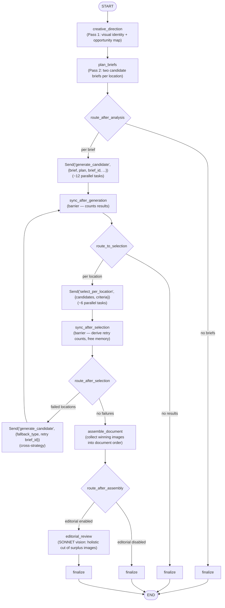
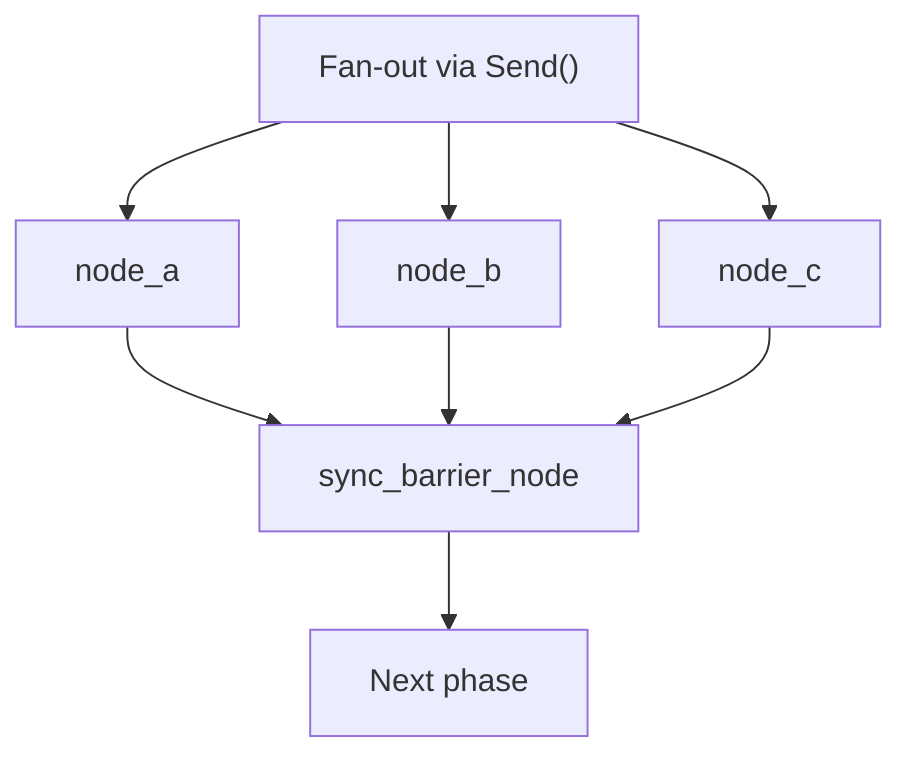

# Document Illustration with Multi-Source Generation

## Intent

Create a workflow that intelligently illustrates markdown documents using multiple image sources (public domain, AI-generated, SVG diagrams) with over-generation, vision-based pair selection, and cross-strategy fallback retries.

## Problem

Document illustration workflows face several challenges:

1. **Multiple image sources** with different APIs, quality characteristics, and costs
2. **Parallel generation** needed for performance but requires careful state aggregation
3. **Quality control** via single-image review is unreliable—comparison is more accurate
4. **Different image types** require specialized handling (diagrams need refinement loops)
5. **Graceful degradation** when preferred sources fail
6. **Diagram engine selection**—different diagram types suit different renderers (Mermaid, Graphviz, raw SVG)
7. **Image search quality**—single queries miss relevant results; multi-query pools with LLM selection improve coverage
8. **AI image quality**—unstructured prompts to Imagen produce inconsistent results

## Solution

A LangGraph workflow with:
- **Two-pass planning**—creative direction (visual identity) followed by brief writing, replacing a single monolithic analysis call
- **Over-generation**—two candidate briefs per location, each taking a genuinely different approach
- **Unified generate_candidate node**—routes to PD/diagram/Imagen based on brief.image_type
- **Per-location pair selection**—vision pair comparison selects the best candidate at each location
- **Quality tiers**—excellent (2 candidates, vision selected), acceptable (1 candidate, auto-selected), failed (0 candidates)
- **Cross-strategy fallback**—when both candidates fail, retry with alternate image source type
- **Sync barrier nodes** for coordination between phases
- **Editorial review**—single SONNET vision call evaluates all non-header images holistically to cut surplus from over-generation
- **Diagram engine routing**—subtype-based routing to Mermaid, Graphviz, or raw SVG with fallback chain
- **Multi-query image search**—literal plus conceptual queries pooled and deduplicated
- **Structured Imagen prompts**—Pydantic schema converts briefs into front-loaded Imagen prompts

### Workflow Architecture



## Implementation

### State Definition with Reducers

The critical pattern: **every field written by parallel branches needs a reducer**.

```python
# workflows/output/illustrate/state.py

class IllustrateState(TypedDict, total=False):
    # Input
    input: IllustrateInput
    config: IllustrateConfig

    # Analysis phase
    extracted_title: str
    image_plan: list[ImageLocationPlan]  # Backward compat: populated from candidate_briefs

    # Creative direction (Pass 1)
    visual_identity: VisualIdentity
    image_opportunities: list[ImageOpportunity]
    editorial_notes: str

    # Candidate briefs (Pass 2) — used by routing to fan out per-brief generation
    candidate_briefs: list[CandidateBrief]

    # Generation phase (parallel aggregation via add reducer)
    generation_results: Annotated[list[ImageGenResult], add]

    # Selection phase (parallel aggregation via add reducer)
    selection_results: Annotated[list[LocationSelection], add]

    # Retry tracking
    retry_count: Annotated[dict[str, int], merge_dicts]  # location_id -> attempt count

    # Final output
    final_images: list[FinalImage]
    illustrated_document: str

    # Assembly phase
    assembled_images: list[AssembledImage]

    # Editorial review
    editorial_review_result: dict  # EditorialReviewResult.model_dump()

    # Workflow metadata
    errors: Annotated[list[WorkflowError], add]
    status: Literal["success", "partial", "failed"]
```

**Key changes from previous architecture**:
- `selection_results` replaces `review_results`, `pending_retries`, `retry_briefs`
- `ImageGenResult` gains `brief_id` for grouping candidates by brief
- `LocationSelection` with `quality_tier` (excellent/acceptable/failed) tracks selection outcomes
- `retry_count` derived from counting "failed" entries in accumulated `selection_results`, not incremented from stale state

### Fan-Out Per CandidateBrief

Route one `Send` per brief for parallel generation:

```python
# workflows/output/illustrate/graph.py

def route_after_analysis(state: IllustrateState) -> list[Send] | str:
    """Fan out one Send per CandidateBrief for parallel generation."""
    candidate_briefs = state.get("candidate_briefs", [])
    image_plan = state.get("image_plan", [])

    if not candidate_briefs or not image_plan:
        return "finalize"

    sends = []
    for brief in candidate_briefs:
        plan = _find_plan_by_id(image_plan, brief.location_id)
        if not plan:
            continue

        brief_id = f"{brief.location_id}_{brief.candidate_index}"
        send_data = {
            "location": plan,
            "brief": brief,
            "brief_id": brief_id,
            "document_context": document,
            "config": config,
            "visual_identity": visual_identity,
        }
        sends.append(Send("generate_candidate", send_data))

    return sends or "finalize"
```

**Pattern**: Fans out per *brief* (not per *location*), producing ~12 parallel tasks for 6 locations with 2 briefs each.

### Unified Candidate Generation

A single node routes to the appropriate generator based on brief.image_type:

```python
# workflows/output/illustrate/nodes/generate_candidate.py

async def generate_candidate_node(state: dict) -> dict:
    """Generate a single image candidate from a CandidateBrief."""
    plan: ImageLocationPlan = state["location"]
    brief: CandidateBrief = state["brief"]
    brief_id: str = state["brief_id"]

    image_type = brief.image_type

    if image_type == "public_domain":
        result = await _generate_public_domain(...)
    elif image_type == "diagram":
        result = await _generate_diagram(...)
    elif image_type == "generated":
        result = await _generate_imagen(...)
    else:
        return _failure_result(...)

    return result
```

This replaces separate `generate_header` and `generate_additional` nodes. The `brief_id` is passed directly into generators (not patched post-hoc).

### Per-Location Pair Selection

After generation, candidates are grouped by location for pair comparison:

```python
# workflows/output/illustrate/nodes/select_per_location.py

async def select_per_location_node(state: dict) -> dict:
    """Select the best image candidate at a location using vision pair comparison.

    Handles three cases:
    - 0 successful candidates -> quality_tier="failed"
    - 1 successful candidate  -> auto-select, quality_tier="acceptable"
    - 2 successful candidates -> vision pair comparison, quality_tier="excellent"
    """
    candidates: list[dict] = state["candidates"]

    if not candidates:
        return {"selection_results": [LocationSelection(quality_tier="failed", ...)]}

    if len(candidates) == 1:
        return {"selection_results": [LocationSelection(quality_tier="acceptable", ...)]}

    # Vision pair comparison
    png_list = [c["image_bytes"] for c in candidates]
    best_idx = await vision_pair_select(png_list, selection_criteria=selection_criteria)
    return {"selection_results": [LocationSelection(quality_tier="excellent", ...)]}
```

**Selection criteria bias fix**: Uses `ImageOpportunity.purpose` and `rationale` (which describe *why* the location needs an image) instead of any candidate's brief text.

### Sync After Selection with Memory Management

```python
def sync_after_selection(state: IllustrateState) -> dict:
    """Barrier: derive retry counts, free non-winning image bytes."""
    selection_results = state.get("selection_results", [])

    # Derive retry counts from scratch — each failed round adds one "failed" entry
    retry_count: dict[str, int] = {}
    for s in selection_results:
        if s["quality_tier"] == "failed":
            retry_count[s["location_id"]] = retry_count.get(s["location_id"], 0) + 1

    # Clear image_bytes from non-winning candidates (in-place mutation)
    # ... identify winning brief_ids, clear losers

    return {"retry_count": retry_count}
```

**Key insight**: `retry_count` is derived from the accumulated `selection_results` list (which grows via `add` reducer across rounds), not incremented from stale state. This prevents the over-inflation bug.

### Cross-Strategy Fallback Retry

When both candidates fail at a location, retry with an alternate image source type:

```python
# workflows/output/illustrate/graph.py

_FALLBACK_IMAGE_TYPE = {
    "public_domain": "generated",
    "generated": "public_domain",
    "diagram": "generated",
}

def route_after_selection(state: IllustrateState) -> list[Send] | str:
    """Route failed locations to retry with cross-strategy fallback."""
    for loc_id in failed_locations:
        for orig_brief in location_briefs[:2]:
            fallback_type = _FALLBACK_IMAGE_TYPE.get(orig_brief.image_type, "generated")
            retry_brief = orig_brief.model_copy(update={"image_type": fallback_type})

            round_num = retry_count.get(loc_id, 0)
            brief_id = f"{loc_id}_{orig_brief.candidate_index}_retry{round_num}"
            sends.append(Send("generate_candidate", {...}))
```

**Key details**:
- `model_copy()` for retry brief construction (not manual dict manipulation)
- Round number in `brief_id` prevents collision when `max_retries > 1`
- `max_retries` reduced from 2 to 1 since over-generation provides inherent redundancy

### Assemble Document and Editorial Review

After selection and retries, images are assembled and optionally reviewed:

```python
# workflows/output/illustrate/nodes/editorial_review.py

async def editorial_review_node(state: IllustrateState) -> dict:
    """Single SONNET vision call evaluating all non-header images."""
    assembled_images = state.get("assembled_images", [])
    non_header_images = [img for img in assembled_images if img["purpose"] != "header"]

    cuts_count = _compute_cuts_count(non_header_images, image_opportunities)

    # Build multimodal message with all images
    content_parts = [{"type": "text", "text": user_prompt}]
    for img in non_header_images:
        # [image, label] pairs interleaved
        content_parts.append({"type": "image", "source": {...}})
        content_parts.append({"type": "text", "text": f"Image '{location_id}' ..."})

    llm = get_llm(tier=ModelTier.SONNET).with_structured_output(EditorialReviewResult)
    response = await llm.ainvoke([system, {"role": "user", "content": content_parts}])
```

Key design decisions:
- **Holistic evaluation**: All images seen simultaneously enables coherence/pacing judgments
- **Adaptive cut count**: `_compute_cuts_count` adapts to selection failures — never cuts below target N
- **Config-gated**: `route_after_assembly()` skips editorial review when `enable_editorial_review=False`
- **Fails open**: If vision call fails, keeps all images

See: [Vision-Based Editorial Curation](../llm-interaction/vision-editorial-curation.md)

### Graph Construction

```python
def create_illustrate_graph() -> StateGraph:
    builder = StateGraph(IllustrateState)

    builder.add_node("creative_direction", creative_direction_node)
    builder.add_node("plan_briefs", plan_briefs_node)
    builder.add_node("generate_candidate", generate_candidate_node)
    builder.add_node("sync_after_generation", sync_after_generation)
    builder.add_node("select_per_location", select_per_location_node)
    builder.add_node("sync_after_selection", sync_after_selection)
    builder.add_node("assemble_document", assemble_document_node)
    builder.add_node("editorial_review", editorial_review_node)
    builder.add_node("finalize", finalize_node)

    builder.add_edge(START, "creative_direction")
    builder.add_edge("creative_direction", "plan_briefs")

    builder.add_conditional_edges("plan_briefs", route_after_analysis,
                                  ["generate_candidate", "finalize"])
    builder.add_edge("generate_candidate", "sync_after_generation")

    builder.add_conditional_edges("sync_after_generation", route_to_selection,
                                  ["select_per_location", "finalize"])
    builder.add_edge("select_per_location", "sync_after_selection")

    builder.add_conditional_edges("sync_after_selection", route_after_selection,
                                  ["generate_candidate", "assemble_document"])
    builder.add_conditional_edges("assemble_document", route_after_assembly,
                                  ["editorial_review", "finalize"])
    builder.add_edge("editorial_review", "finalize")
    builder.add_edge("finalize", END)

    return builder.compile()
```

### Diagram Engine Routing

The `generate_candidate` node delegates diagram generation to the appropriate engine:

```python
# workflows/output/illustrate/nodes/generate_additional.py

_MERMAID_SUBTYPES = {"flowchart", "sequence", "concept_map"}
_GRAPHVIZ_SUBTYPES = {"network_graph", "hierarchy", "dependency_tree"}

async def _generate_diagram(location_id, plan, brief, config, ...):
    subtype = plan.diagram_subtype

    if subtype in _MERMAID_SUBTYPES and is_engine_available("mermaid"):
        result = await generate_mermaid_with_selection(...)
    elif subtype in _GRAPHVIZ_SUBTYPES and is_engine_available("graphviz"):
        result = await generate_graphviz_with_selection(...)

    # Fallback to SVG if preferred engine failed or unavailable
    if result is None or not result.success:
        result = await generate_diagram(...)
```

See: [Diagram Engine Registry and Routing](../llm-interaction/diagram-engine-registry-routing.md)

### Multi-Query Image Search

Public domain image search uses multiple queries (literal + conceptual):

```python
async def _generate_public_domain(location_id, plan, brief, document_context, brief_id):
    queries = _build_search_queries(plan)  # Interleaves conceptual + literal
    if queries:
        pool = await service.search_pool(queries=queries, limit_per_query=3)
        result = await select_best_image(pool, query=queries[0], ...)
```

### SSRF Prevention

Image downloads validate URLs before fetching:

```python
def _validate_image_url(url: str) -> None:
    parsed = urlparse(url)
    if parsed.scheme != "https":
        raise ValueError(f"Only HTTPS URLs allowed")
    ip = ipaddress.ip_address(hostname)
    if ip.is_private or ip.is_loopback or ip.is_reserved:
        raise ValueError(f"Private/reserved IP not allowed")
```

### Winning Result Selection in Finalize

```python
def _select_winning_results(generation_results, selection_results):
    """Pick the winning ImageGenResult per location."""
    # Deduplicate selections: keep LAST entry per location_id.
    # selection_results uses add reducer — retry entries appear after earlier rounds.
    latest_selection: dict[str, LocationSelection] = {}
    for selection in selection_results:
        latest_selection[selection["location_id"]] = selection

    # Match selected_brief_id to generation results
    for loc_id, selection in latest_selection.items():
        if selection["quality_tier"] != "failed":
            brief_id = selection["selected_brief_id"]
            winners.append(results_by_brief_id[brief_id])
```

## Key Design Patterns

### Reducer Selection Guide

| State Field Type | Parallel Writes? | Recommended Reducer |
|------------------|------------------|---------------------|
| `list[T]` | Yes | `Annotated[list[T], add]` |
| `dict[str, T]` | Yes | `Annotated[dict[str, T], merge_dicts]` |
| Scalar | No | No reducer (last-write-wins) |
| Scalar | Yes | Custom reducer or restructure |

### Add Reducer with Retry Loops

When using `Annotated[list, add]` in a workflow with retry loops, the list accumulates entries across all rounds. This has implications:

- **Deduplication required**: When selecting results, keep the *last* entry per key (not the first), since retry-round entries appear after earlier rounds.
- **Derive counts from scratch**: Don't increment counters from stale state—count entries in the full accumulated list.
- **Memory cleanup**: Clear large payloads (image bytes) from non-winning entries in-place, since the list cannot be replaced.

### Sync Barrier Pattern



### Cross-Strategy Fallback Pattern

```python
_FALLBACK_IMAGE_TYPE = {
    "public_domain": "generated",
    "generated": "public_domain",
    "diagram": "generated",
}
# When both candidates at a location fail, retry with the alternate source type
```

## Trade-offs

| Aspect | Benefit | Cost |
|--------|---------|------|
| Two-pass planning | Visual consistency, better briefs | Two Sonnet calls instead of one, sequential latency |
| Over-generation (2 per location) | Built-in redundancy, better quality via comparison | 2x generation cost per location |
| Per-location pair selection | 80.6 percent accuracy vs scoring | One Sonnet vision call per location |
| Cross-strategy fallback | Higher success rate on failures | Different source type may not match brief |
| Unified generate_candidate | Simpler graph, one node type | Routing logic in node |
| Sync barriers | Clean phase separation | Additional graph nodes |
| Engine routing | Best renderer per diagram type | Registry + routing logic |
| Multi-query search | Broader candidate pool | More API calls per image |
| Structured Imagen prompts | Consistent quality | Extra Haiku call per generation |
| Memory cleanup in sync | Reduced memory after selection | In-place mutation of reducer-managed list |
| Editorial review | Document-level quality gating | One extra Sonnet vision call, memory spike from base64 encoding |

## Related Patterns

- [Over-Generation with Per-Location Pair Selection](./over-generation-pair-selection.md): The over-generation + selection pattern in detail
- [Two-Pass LLM Planning](../llm-interaction/two-pass-llm-planning.md): The two-pass creative direction + brief planning pattern
- [Parallel Candidate Vision Selection](../llm-interaction/parallel-candidate-vision-selection.md): Multi-candidate generation + vision selection
- [Diagram Engine Registry and Routing](../llm-interaction/diagram-engine-registry-routing.md): Lazy engine detection + subtype routing
- [Validate-Repair-Render Loop](../llm-interaction/validate-repair-render-loop.md): Mermaid/Graphviz generation pattern
- [Structured Imagen Prompts](../llm-interaction/structured-imagen-prompts.md): Brief-to-prompt conversion
- [Vision-Based Editorial Curation](../llm-interaction/vision-editorial-curation.md): Holistic multi-image review pattern

## Related Solutions

- [Over-Generation Retry and Selection Logic Bugs](../../solutions/workflow-reliability/overgeneration-retry-selection-bugs.md): 15 code review findings from over-generation implementation
- [Editorial Review Code Findings](../../solutions/workflow-reliability/editorial-review-code-findings.md): 15 code review findings from editorial review

## References

- Commit: `6909ba2`—feat(illustrate): add document illustration workflow
- Commit: `feeaa1b`—feat(illustrate): quick wins for image quality
- Commit: `b5336d9`—feat(illustrate): diagram engine overhaul
- Commit: `9e43702`—fix(illustrate): resolve 14 code review findings
- Commit: `cc870ae`—feat(illustrate): two-pass planning with visual identity
- Commit: `e7c0d34`—fix(illustrate): resolve nine code review findings
- Commit: `57fa0cf`—feat(illustrate): over-generation with per-location pair selection
- Commit: `de777b2`—fix(illustrate): resolve 15 code review findings
- Commit: `c56a75b`—feat(illustrate): editorial review — vision-based full-document curation
- Commit: `d2557a9`—fix(illustrate): resolve 15 code review findings — DRY, schemas, security, dead code
- Files:
  - `workflows/output/illustrate/graph.py`—main workflow graph
  - `workflows/output/illustrate/state.py`—state with reducers
  - `workflows/output/illustrate/nodes/creative_direction.py`—Pass 1: visual identity plus opportunity map
  - `workflows/output/illustrate/nodes/plan_briefs.py`—Pass 2: candidate briefs
  - `workflows/output/illustrate/nodes/generate_candidate.py`—unified candidate generation node
  - `workflows/output/illustrate/nodes/generate_additional.py`—engine routing, multi-query search, SSRF validation
  - `workflows/output/illustrate/nodes/select_per_location.py`—per-location vision pair selection
  - `workflows/output/illustrate/nodes/editorial_review.py`—editorial review node
  - `workflows/output/illustrate/nodes/assemble_document.py`—document assembly node
  - `workflows/output/illustrate/nodes/finalize.py`—winning result selection and markdown insertion
  - `workflows/output/illustrate/schemas.py`—VisualIdentity, ImageOpportunity, CandidateBrief, ImageLocationPlan
  - `workflows/output/illustrate/prompts.py`—two-pass prompts plus build_visual_identity_context()
  - `workflows/shared/vision_comparison.py`—tournament-style vision pair comparison
  - `workflows/shared/diagram_utils/registry.py`—engine availability registry
  - `workflows/shared/diagram_utils/mermaid.py`—Mermaid engine with validate-repair loop
  - `workflows/shared/diagram_utils/graphviz_engine.py`—Graphviz engine with validate-repair loop
  - `workflows/shared/imagen_prompts.py`—structured Imagen prompt builder
  - `workflows/shared/image_utils.py`—multi-candidate Imagen generation
  - `core/images/selection.py`—weighted rubric image selection
  - `core/images/service.py`—multi-query search pool
