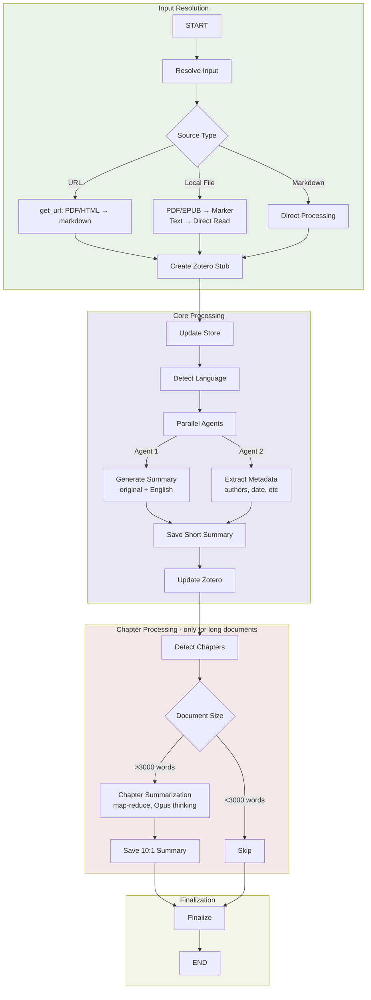

# Document Processing Workflow

A comprehensive document processing workflow that converts documents to markdown, extracts metadata, generates summaries, and manages Zotero integration. Supports PDFs, EPUBs, URLs, and plain text with intelligent multi-language handling and optional 10:1 summarization for long documents.

## Usage

```python
from workflows.document_processing import process_document

# Process a PDF URL
result = await process_document(
    source="https://example.com/paper.pdf",
    title="My Research Paper",
    item_type="journalArticle",
    langs=["English"],
)

# Process a local file
result = await process_document(
    source="/path/to/document.pdf",
    title="Book Title",
    item_type="book",
)

# Process markdown text directly
result = await process_document(
    source="# My Document\n\nContent here...",
    title="Direct Input",
)

# Access results
summary = result["short_summary"]
metadata = result["metadata_updates"]
zotero_key = result["zotero_key"]
```

### Batch Processing

```python
from workflows.document_processing import process_documents_batch

documents = [
    {"source": "https://example.com/paper1.pdf", "title": "Paper 1"},
    {"source": "/local/paper2.pdf", "title": "Paper 2"},
    {"source": "markdown text...", "title": "Paper 3"},
]

results = await process_documents_batch(documents, concurrency=5)
```

### Batch API Mode (50% Cost Savings)

```python
from workflows.document_processing import process_documents_with_batch_api

# For bulk processing with delayed results
results = await process_documents_with_batch_api(
    documents=[
        {"source": url, "title": title}
        for url, title in document_list
    ],
    poll_interval=60,  # Check every 60 seconds
)
```

### Examples

```bash
# Process single document
python -m testing.test_doc_processing https://example.com/paper.pdf

# Batch process multiple documents
python -m testing.test_doc_batch_processing urls.txt

# Disable batch API for rapid iteration
python -m testing.test_doc_processing paper.pdf --no-batch
```

## Input/Output

| | Format | Description |
|---|--------|-------------|
| **Input** | URL / File Path / Markdown | PDF, EPUB, HTML, or plain text/markdown |
| **Output** | ProcessingResult | Markdown content, summaries (original + English), metadata, Zotero key |

### Input Parameters

- `source`: URL, local file path, or markdown text
- `title`: Document title (optional, extracted from metadata if available)
- `item_type`: Zotero item type (default: "document")
- `langs`: Languages for OCR (default: ["English"])
- `extra_metadata`: Additional metadata dict (optional)
- `use_batch_api`: Enable Anthropic Batch API for cost savings (default: True)

### Output Fields

- `processing_result`: Markdown, chunks, page/word counts
- `short_summary_original`: Summary in document's original language
- `short_summary_english`: English translation (if non-English)
- `tenth_summary_original`: 10:1 summary for long documents (>3000 words)
- `tenth_summary_english`: English translation of 10:1 summary
- `metadata_updates`: Extracted metadata (authors, date, DOI, etc.)
- `zotero_key`: Zotero library item key
- `store_records`: Created store record references
- `chapters`: Chapter boundaries for long documents
- `original_language`: Detected ISO 639-1 language code
- `errors`: Error tracking list

## Workflow



## Phase Summary

- **Input Resolution**: Converts various source formats (URL, PDF, EPUB, local files) to markdown using appropriate tools (get_url, Marker OCR)
- **Core Processing**: Parallel extraction of summary and metadata, with language detection enabling dual-language summaries for non-English documents
- **Chapter Processing**: For documents >3000 words, detects logical chapter boundaries and generates hierarchical 10:1 summaries using Opus with extended thinking
- **Finalization**: Aggregates results, updates Zotero library, and provides comprehensive output

## Features

### Multi-Language Support

Documents are automatically detected for language and processed accordingly:
- Summaries generated in original language
- Automatic English translation for non-English content
- OCR supports multiple languages via Marker

### Cost Optimization

- **Prompt Caching**: 90% cost reduction for repeated summarization tasks
- **Batch API**: 50% cost reduction when processing 5+ chapters or multiple documents
- **Smart Chunking**: Long chapters (>600k chars) split to avoid token limits

### Intelligent Chapter Detection

- LLM-powered heading analysis identifies chapter boundaries
- Handles multi-author books with per-chapter attribution
- Fallback strategies for documents without clear heading structure
- Configurable thresholds for 10:1 summarization

### Zotero Integration

- Creates stub entries for tracking
- Extracts and updates metadata (authors, DOI, publication date)
- Stores summaries as Zotero notes
- Supports custom item types

### Store Management

- Parallel writes to store at multiple compression levels
- Language-tagged records for original vs. English content
- Content chunking by headings for efficient retrieval
