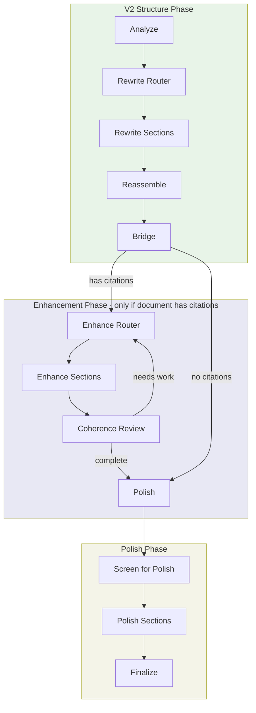

# Editing Workflow

A structural editing workflow that improves document coherence and quality through multi-phase analysis and enhancement. It analyzes markdown documents at the section level, rewrites sections that need structural improvements, enhances sections with supporting evidence from a paper corpus (when citations are present), and polishes for flow—all while preserving the document's core content and meaning.

> **Note**: Fact-checking and reference validation are now in a separate [Fact-Check](../fact_check/README.md) workflow that runs after editing.

## Usage

```python
from workflows.enhance.editing import editing

result = await editing(
    document=markdown_text,
    topic="Attention mechanisms in transformers",
    quality="standard",
)

edited_document = result["final_report"]
```

### Examples

```bash
# Quick edit for fast iteration
python -m testing.test_editing_workflow my_doc.md --quality quick

# Standard quality (recommended)
python -m testing.test_editing_workflow my_doc.md --quality standard

# High quality for final output
python -m testing.test_editing_workflow my_doc.md --quality high_quality
```

## Input/Output

| | Format | Description |
|---|--------|-------------|
| **Input** | Markdown | Document with standard markdown headings (`#`, `##`, etc.) |
| **Output** | Markdown | Edited document with improved structure and coherence |

The workflow also returns metadata including verification scores, applied changes summary, and any unresolved issues.

## Architecture

The workflow uses a hybrid approach:
- **V2 Structure Phase**: Simple 3-step section-level rewriting (analyze → rewrite → reassemble)
- **Bridge**: Converts V2 markdown output to DocumentModel for downstream phases
- **V1 Enhancement/Polish Phases**: Preserved from original workflow for citation enhancement and polishing



### Phase Summary

| Phase | Description | Parallelism |
|-------|-------------|-------------|
| **Analyze** | Global analysis identifies sections needing work (expand, condense, rewrite, merge, delete) | Single LLM call |
| **Rewrite** | Each flagged section is rewritten following its instruction | Parallel workers |
| **Reassemble** | Combines rewritten sections, verifies coherence | Single step |
| **Bridge** | Parses markdown to DocumentModel, detects citations | Single step |
| **Enhancement** | Strengthens arguments with evidence from paper corpus | Parallel workers |
| **Polish** | Improves sentence-level flow and transitions | Sequential |

### V2 Structure Phase Details

The V2 structure phase operates at the **top-level section** (H1) granularity:

1. **Analyze**: Uses Opus to identify structural issues across the full document
   - Generates `EditInstruction` for each section needing work
   - Instruction types: `rewrite`, `expand`, `condense`, `merge_into`, `delete`

2. **Rewrite**: Parallel workers process each instruction
   - Each worker receives section content + adjacent context
   - Validates citation preservation and length constraints
   - Warnings logged for validation issues (workflow continues)

3. **Reassemble**: Combines results into final markdown
   - Handles deletions and merges
   - Performs coherence verification

## Quality Settings

| Setting | test | quick | standard | comprehensive | high_quality |
|---------|------|-------|----------|---------------|--------------|
| Enhance iterations | 1 | 2 | 3 | 4 | 5 |
| Polish sections | 3 | 5 | 10 | 15 | 20 |
| Use Opus for analysis | ✗ | ✗ | ✓ | ✓ | ✓ |
| Use Opus for generation | ✗ | ✗ | ✗ | ✓ | ✓ |
| Coherence threshold | 0.60 | 0.70 | 0.75 | 0.80 | 0.85 |

**Recommended**: Use `quick` for drafts, `standard` for most documents, `comprehensive` or `high_quality` for final publication.

## Module Structure

```
editing/
├── __init__.py           # Package exports
├── state.py              # EditingState TypedDict
├── parser.py             # Markdown → DocumentModel parser
├── document_model.py     # Section/Block data structures
├── schemas.py            # Pydantic schemas (including V2 schemas)
├── prompts.py            # LLM prompts (including V2 prompts)
├── quality_presets.py    # Quality tier configurations
├── graph/
│   ├── construction.py   # LangGraph workflow definition
│   └── api.py            # Main entry point (editing function)
└── nodes/
    ├── v2_analyze.py     # V2 structure analysis
    ├── v2_rewrite_section.py  # V2 parallel section rewriting
    ├── v2_reassemble.py  # V2 reassembly and verification
    ├── v2_router.py      # V2 Send-based routing
    ├── bridge.py         # V2 → V1 bridge node
    ├── enhance_section.py
    ├── enhance_coherence.py
    ├── polish.py
    └── finalize.py
```
