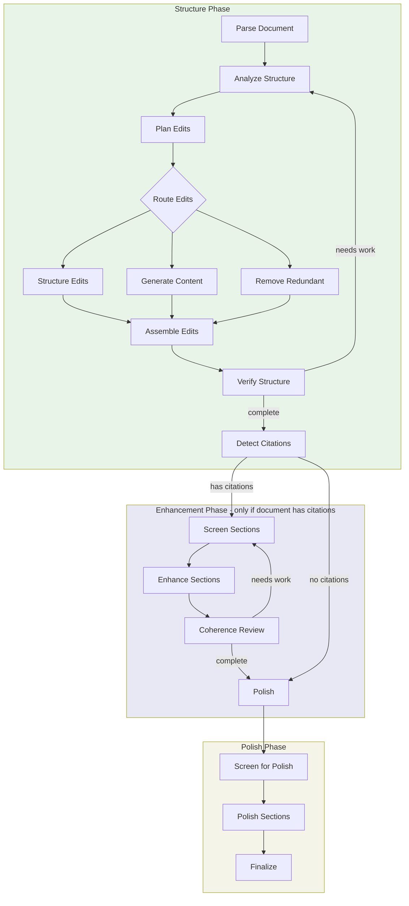

# Editing Workflow

A structural editing workflow that improves document coherence and quality through multi-phase analysis and enhancement. It parses markdown documents into a structured model, identifies and fixes structural issues (missing introductions, content sprawl, redundancy), enhances sections with supporting evidence from a paper corpus, and polishes for flow—all while preserving the document's core content and meaning.

> **Note**: Fact-checking and reference validation are now in a separate [Fact-Check](../fact_check/README.md) workflow that runs after editing.

## Usage

```python
from workflows.enhance.editing import editing

result = await editing(
    document=markdown_text,
    topic="Attention mechanisms in transformers",
    quality="standard",
)

edited_document = result["final_report"]
```

### Examples

```bash
# Quick edit for fast iteration
python -m testing.test_editing_workflow my_doc.md --quality quick

# Standard quality (recommended)
python -m testing.test_editing_workflow my_doc.md --quality standard

# High quality for final output
python -m testing.test_editing_workflow my_doc.md --quality high_quality
```

## Input/Output

| | Format | Description |
|---|--------|-------------|
| **Input** | Markdown | Document with standard markdown headings (`#`, `##`, etc.) |
| **Output** | Markdown | Edited document with improved structure and coherence |

The workflow also returns metadata including verification scores, applied changes summary, and any unresolved issues.

## Workflow



### Phase Summary

- **Structure**: Reorganizes sections, generates missing intros/conclusions, removes redundancy
- **Enhancement**: Strengthens arguments with evidence from paper corpus (parallel workers)
- **Polish**: Improves sentence-level flow and transitions

## Quality Settings

| Setting | test | quick | standard | comprehensive | high_quality |
|---------|------|-------|----------|---------------|--------------|
| Structure iterations | 1 | 2 | 3 | 4 | 5 |
| Enhance iterations | 1 | 2 | 3 | 4 | 5 |
| Polish sections | 3 | 5 | 10 | 15 | 20 |
| Use Opus for analysis | ✗ | ✗ | ✓ | ✓ | ✓ |
| Use Opus for generation | ✗ | ✗ | ✗ | ✓ | ✓ |
| Coherence threshold | 0.60 | 0.70 | 0.75 | 0.80 | 0.85 |

**Recommended**: Use `quick` for drafts, `standard` for most documents, `comprehensive` or `high_quality` for final publication.
