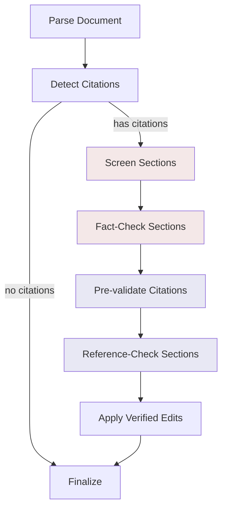

# Fact-Check Workflow

A verification workflow that fact-checks claims and validates citations in academic documents. It screens sections for factual content, verifies claims using the paper corpus and Perplexity, validates that citations exist and support their claims, and applies corrections automatically.

## Usage

```python
from workflows.enhance.fact_check import fact_check

result = await fact_check(
    document=markdown_text,
    topic="Attention mechanisms in transformers",
    quality="standard",
)

verified_document = result["final_report"]
```

### With Pre-parsed Document Model

If running after the editing workflow, pass the document model to avoid re-parsing:

```python
result = await fact_check(
    document_model=editing_result["document_model"],
    topic="Attention mechanisms",
    quality="standard",
    has_citations=True,
    citation_keys=["ABC12345", "XYZ67890"],
)
```

## Input/Output

| | Format | Description |
|---|--------|-------------|
| **Input** | Markdown or DocumentModel | Document with citations in `[@KEY]` format |
| **Output** | Markdown | Verified document with corrections applied |

## Workflow



### Phase Summary

- **Screening**: Identifies sections with verifiable factual claims (uses Haiku for speed)
- **Fact-Check**: Verifies claims using paper corpus and Perplexity
- **Reference-Check**: Validates citation keys exist and papers support their claims
- **Apply Edits**: Applies high-confidence corrections automatically

## Quality Settings

| Setting | test | quick | standard | comprehensive | high_quality |
|---------|------|-------|----------|---------------|--------------|
| Perplexity fact-check | ✗ | ✓ | ✓ | ✓ | ✓ |
| Confidence threshold | 0.70 | 0.70 | 0.75 | 0.80 | 0.85 |
| Max tool calls (fact) | 5 | 10 | 15 | 18 | 20 |
| Max tool calls (ref) | 3 | 5 | 8 | 10 | 12 |

## Return Values

| Field | Type | Description |
|-------|------|-------------|
| `final_report` | str | Verified document with corrections |
| `status` | str | `"success"`, `"partial"`, `"failed"`, or `"skipped"` |
| `langsmith_run_id` | str | LangSmith tracing ID |
| `errors` | list | Any errors encountered during workflow |
| `started_at` | datetime | Workflow start timestamp |
| `completed_at` | datetime | Workflow completion timestamp |
| `changes_summary` | str | Summary of verification results |
| `fact_check_results` | list | Per-section fact-check results |
| `reference_check_results` | list | Per-section reference validation results |
| `applied_edits` | list | Corrections that were applied |
| `skipped_edits` | list | Edits that couldn't be applied (logged) |
| `unresolved_items` | list | Issues logged for manual review |
| `document_model` | dict | Updated document model (for downstream workflows) |
| `has_citations` | bool | Whether citations were detected |
| `citation_keys` | list | Citation keys found in document |
