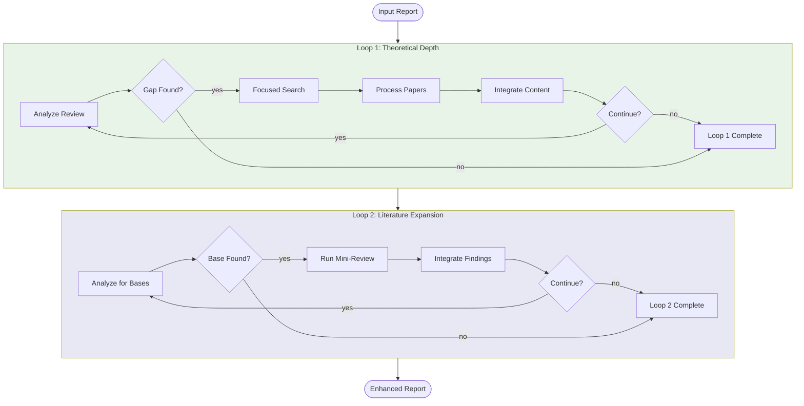

# Supervision Workflow

A content enhancement workflow that deepens theoretical foundations and expands literature coverage in academic documents. It analyzes markdown reports for theoretical gaps, discovers relevant academic literature to address those gaps, and integrates new perspectives from adjacent literature bases—all while preserving the document's structure and argument flow.

## Usage

```python
from workflows.enhance.supervision import enhance_report

result = await enhance_report(
    report=markdown_text,
    topic="Attention mechanisms in transformers",
    research_questions=["How do attention mechanisms improve model performance?"],
    quality="standard",
    loops="all",
    max_iterations_per_loop=3,  # optional, default 3
    supervision_paper_factor=0.5,  # optional, multiplier for max_papers
    paper_corpus=existing_papers,  # optional, DOI -> PaperMetadata
    paper_summaries=existing_summaries,  # optional, DOI -> PaperSummary
    zotero_keys=existing_keys,  # optional, DOI -> Zotero key
)

enhanced_document = result["final_report"]
```

### Loop Selection

```python
# Both loops (default) - full enhancement
result = await enhance_report(..., loops="all")

# Loop 1 only - theoretical depth
result = await enhance_report(..., loops="one")

# Loop 2 only - literature expansion
result = await enhance_report(..., loops="two")

# Skip supervision (useful when chaining with editing)
result = await enhance_report(..., loops="none")
```

## Input/Output

| | Format | Description |
|---|--------|-------------|
| **Input** | Markdown | Academic document with research topic and questions |
| **Output** | Markdown | Enhanced document with deeper theory and broader literature |

The workflow also returns:
- `paper_corpus`: Merged paper corpus including newly discovered papers (DOI → metadata)
- `paper_summaries`: Merged summaries of integrated papers
- `zotero_keys`: Merged citation keys for bibliography management
- `loops_run`: Which loops executed successfully
- `review_loop1`: Report state after Loop 1 (if run)
- `review_loop2`: Report state after Loop 2 (if run)
- `completion_reason`: Summary of how enhancement completed
- `errors`: List of any errors encountered during processing

## Workflow



### Loop 1: Theoretical Depth

Identifies and fills theoretical gaps in the document:

1. **Analyze**: Opus examines the review for missing theoretical foundations, methodological grounding, or unifying threads
2. **Search**: Runs focused keyword search to discover papers addressing the gap
3. **Process**: Retrieves and summarizes relevant papers via document processing pipeline
4. **Integrate**: Weaves new theoretical content into the existing document

Iterates until the supervisor approves theoretical depth or max iterations reached.

### Loop 2: Literature Expansion

Broadens the document's perspective by discovering adjacent literature bases:

1. **Analyze**: Identifies literature bases not yet represented (e.g., health economics for a medical AI paper)
2. **Mini-Review**: Runs a condensed literature review on the identified base
3. **Integrate**: Incorporates the mini-review findings, adding supportive, challenging, or analogous perspectives

Each iteration explores one new literature base, building a more comprehensive argument.

## Quality Settings

Quality affects the underlying literature review parameters:

| Setting | quick | standard | comprehensive | high_quality |
|---------|-------|----------|---------------|--------------|
| Max diffusion stages | 2 | 3 | 4 | 5 |
| Max papers processed | 50 | 100 | 200 | 300 |
| Min citations filter | 5 | 10 | 10 | 10 |
| Default iterations/loop | 3 | 3 | 3 | 3 |

**Recommended**: Use `quick` for drafts or testing, `standard` for most documents, `comprehensive` or `high_quality` when thorough literature coverage is critical.

## Handling Empty Corpus

The workflow gracefully handles documents without an existing paper corpus:

- **Loop 1**: Runs fresh keyword searches to discover foundational literature
- **Loop 2**: Mini-reviews discover all papers fresh (no exclusion set)

This makes supervision useful both for enhancing existing lit reviews and for bootstrapping new ones from a draft outline.
