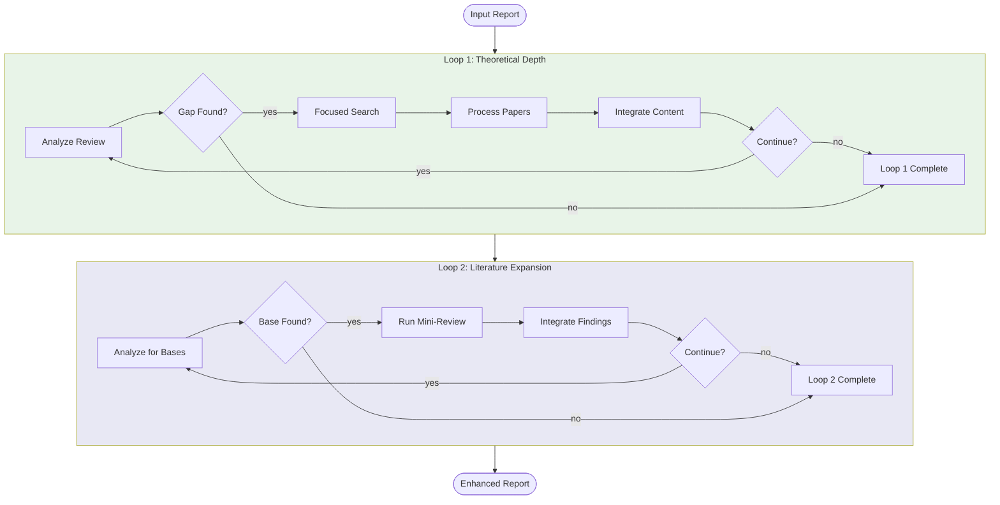

# Supervision Workflow

A content enhancement workflow that deepens theoretical foundations and expands literature coverage in academic documents. It analyzes markdown reports for theoretical gaps, discovers relevant academic literature to address those gaps, and integrates new perspectives from adjacent literature bases—all while preserving the document's structure and argument flow.

## Usage

```python
from workflows.enhance.supervision import enhance_report

result = await enhance_report(
    report=markdown_text,
    topic="Attention mechanisms in transformers",
    research_questions=["How do attention mechanisms improve model performance?"],
    quality="standard",
    loops="all",
    max_iterations_per_loop=3,  # optional, default 3
    supervision_paper_factor=0.5,  # optional, multiplier for max_papers
    paper_corpus=existing_papers,  # optional, DOI -> PaperMetadata
    paper_summaries=existing_summaries,  # optional, DOI -> PaperSummary
    zotero_keys=existing_keys,  # optional, DOI -> Zotero key
)

enhanced_document = result["final_report"]
```

### Loop Selection

```python
# Both loops (default) - full enhancement
result = await enhance_report(..., loops="all")

# Loop 1 only - theoretical depth
result = await enhance_report(..., loops="one")

# Loop 2 only - literature expansion
result = await enhance_report(..., loops="two")

# Skip supervision (useful when chaining with editing)
result = await enhance_report(..., loops="none")
```

## Input/Output

| | Format | Description |
|---|--------|-------------|
| **Input** | Markdown | Academic document with research topic and questions |
| **Output** | Markdown | Enhanced document with deeper theory and broader literature |

The workflow also returns:
- `paper_corpus`: Merged paper corpus including newly discovered papers (DOI → metadata)
- `paper_summaries`: Merged summaries of integrated papers
- `zotero_keys`: Merged citation keys for bibliography management
- `loops_run`: Which loops executed successfully
- `review_loop1`: Report state after Loop 1 (if run)
- `review_loop2`: Report state after Loop 2 (if run)
- `completion_reason`: Summary of how enhancement completed
- `errors`: List of any errors encountered during processing

## Workflow


```mermaid
flowchart TD
    subgraph loop1 ["Loop 1: Theoretical Depth"]
        A[Analyze Review] --> B{Gap Found?}
        B -->|yes| C[Focused Search]
        C --> D[Process Papers]
        D --> E[Integrate Content]
        E --> F{Continue?}
        F -->|yes| A
        F -->|no| G[Loop 1 Complete]
        B -->|no| G
    end

    subgraph loop2 ["Loop 2: Literature Expansion"]
        H[Analyze for Bases] --> I{Base Found?}
        I -->|yes| J[Run Mini-Review]
        J --> K[Integrate Findings]
        K --> L{Continue?}
        L -->|yes| H
        L -->|no| M[Loop 2 Complete]
        I -->|no| M
    end

    START([Input Report]) --> loop1
    loop1 --> loop2
    loop2 --> END([Enhanced Report])

    style loop1 fill:#e8f4e8
    style loop2 fill:#e8e8f4
```

### Loop 1: Theoretical Depth

Identifies and fills theoretical gaps in the document:

1. **Analyze**: Opus examines the review for missing theoretical foundations, methodological grounding, or unifying threads
2. **Search**: Runs focused keyword search to discover papers addressing the gap
3. **Process**: Retrieves and summarizes relevant papers via document processing pipeline
4. **Integrate**: Weaves new theoretical content into the existing document

Iterates until the supervisor approves theoretical depth or max iterations reached.

### Loop 2: Literature Expansion

Broadens the document's perspective by discovering adjacent literature bases:

1. **Analyze**: Identifies literature bases not yet represented (e.g., health economics for a medical AI paper)
2. **Mini-Review**: Runs a condensed literature review on the identified base
3. **Integrate**: Incorporates the mini-review findings, adding supportive, challenging, or analogous perspectives

Each iteration explores one new literature base, building a more comprehensive argument.

## Integrator Behaviour

### Word budgets

Integration LLM calls are given an explicit per-step budget. Body word counts exclude the trailing `## References` block (see "References handling" below). The LLM is told it may condense existing prose ONLY when necessary to fit the budget AND only when the new material better answers the research questions than the detail it displaces.

| Step | Budget |
|---|---|
| Combine phase (web_augmented only) | `target_word_count + 2000` |
| Loop 1 per integration | `body_words_in + 3000` |
| Loop 2 per iteration | `body_words_in + 2000` |

Under `standard` (target 12,000) this yields: Phase 1 ≤ 12k → combine ≤ 14k → Loop 1 ≤ 17k → Loop 2 iter 1 ≤ 19k → Loop 2 iter 2 ≤ 21k, all before the editing phase. Helper: `workflows.enhance.supervision.shared.prompts.build_word_budget_guidance`.

### References handling

Every integration call operates on **prose only**. `split_references()` (from `workflows/shared/reference_utils.py`) strips the trailing `## References` / `## Sources` / `## Bibliography` block before the LLM call; the block is reattached afterwards with entries for newly-integrated papers appended deterministically. The integrator prompts explicitly forbid emitting a references section. This saves ~1,300 output tokens per integrator call and removes the risk of the LLM corrupting citation keys.

### Fail-out on loop errors

`run_loop1_node` and `run_loop2_node` in `nodes.py` raise `RuntimeError` if the underlying loop returns with any errors or an inner node exception propagates. This turns silent Loop-2 failures (e.g. yesterday's stale `name 'invoke' is not defined` issue) into task-level failures, so the workflow executor marks the task as failed rather than reporting "success" with a no-op supervision phase.

## Quality Settings

Quality affects the underlying literature review parameters:

| Setting | quick | standard | comprehensive | high_quality |
|---------|-------|----------|---------------|--------------|
| Max diffusion stages | 2 | 3 | 4 | 5 |
| Max papers processed | 50 | 100 | 200 | 300 |
| Min citations filter | 5 | 10 | 10 | 10 |
| Default iterations/loop | 3 | 3 | 3 | 3 |

**Recommended**: Use `quick` for drafts or testing, `standard` for most documents, `comprehensive` or `high_quality` when thorough literature coverage is critical.

## Handling Empty Corpus

The workflow gracefully handles documents without an existing paper corpus:

- **Loop 1**: Runs fresh keyword searches to discover foundational literature
- **Loop 2**: Mini-reviews discover all papers fresh (no exclusion set)

This makes supervision useful both for enhancing existing lit reviews and for bootstrapping new ones from a draft outline.
