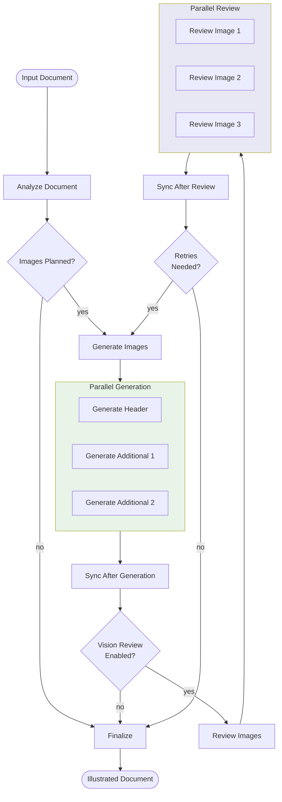

# Illustrate Workflow

Intelligently adds images to markdown documents using three sources: public domain photos, AI-generated images, and SVG diagrams.

## Usage

```python
from workflows.output.illustrate import illustrate_graph, IllustrateConfig

result = await illustrate_graph.ainvoke({
    "input": {
        "markdown_document": "# My Article\n\nContent here...",
        "title": "My Article",
        "output_dir": "/path/to/images",
    },
    "config": IllustrateConfig(
        additional_image_count=2,
        enable_vision_review=True,
    ),
})

# Access results
illustrated_doc = result["illustrated_document"]
images = result["final_images"]
status = result["status"]  # "success", "partial", or "failed"
```

## Input/Output

| | Format | Description |
|---|--------|-------------|
| **Input** | Markdown | Document content, optional title and output directory |
| **Output** | Markdown | Document with image references inserted below headers |

Additional outputs:
- `final_images`: List of saved images with metadata (path, alt text, attribution)
- `status`: Workflow completion status
- `errors`: List of warnings/errors encountered during generation

## Workflow



### Image Generation

Each image location is processed in parallel:

1. **Header Image**: Searches public domain first, evaluates "appositeness" with vision, falls back to Imagen if not particularly fitting
2. **Additional Images**: Uses planned type (public_domain, diagram, or generated)
3. **Vision Review**: Sonnet evaluates each image for context fit and errors
4. **Retry Logic**: Images with substantive errors are regenerated once with improved briefs

### Image Types

- **public_domain**: Searches Pexels/Unsplash with LLM-assisted selection
- **diagram**: SVG generated by Claude, converted to PNG with optional quality refinement
- **generated**: Google Imagen creates images from AI-optimized prompts

## Quality Settings

| Setting | Default | Description |
|---------|---------|-------------|
| `generate_header_image` | `True` | Whether to create a header image |
| `additional_image_count` | `2` | Number of additional images (0-5) |
| `header_prefer_public_domain` | `True` | Try public domain for header first |
| `imagen_aspect_ratio` | `"16:9"` | Aspect ratio for generated images |
| `diagram_width` | `800` | SVG diagram width in pixels |
| `diagram_height` | `600` | SVG diagram height in pixels |

### Vision Review Settings

| Setting | Default | Description |
|---------|---------|-------------|
| `enable_vision_review` | `True` | Enable Sonnet vision review |
| `max_retries` | `1` | Max retry attempts for failed images |

### Diagram Refinement Settings

| Setting | Default | Description |
|---------|---------|-------------|
| `enable_diagram_refinement` | `True` | Enable iterative quality improvement |
| `diagram_quality_threshold` | `4.7` | Minimum quality score (1-5 scale) |
| `diagram_max_refinement_iterations` | `3` | Max refinement rounds |

## Configuration

```python
from workflows.output.illustrate import IllustrateConfig

# Minimal configuration (use defaults)
config = IllustrateConfig()

# Header only, no review
config = IllustrateConfig(
    additional_image_count=0,
    enable_vision_review=False,
)

# Maximum images with high-quality diagrams
config = IllustrateConfig(
    additional_image_count=5,
    diagram_quality_threshold=4.9,
    diagram_max_refinement_iterations=5,
)
```

## Environment Variables

Requires the following services:
- **Anthropic API**: For Sonnet (analysis, review) and Claude (diagrams)
- **Google Vertex AI**: For Imagen image generation
- **Pexels/Unsplash**: For public domain image search

## Image Attribution

Images are automatically attributed in the markdown output:
- **Public Domain**: "Photo by [photographer] via [source](url)"
- **Diagram**: "Diagram generated by Claude"
- **Generated**: "Image generated by Imagen"

## Model Usage

| Node | Model | Purpose |
|------|-------|---------|
| analyze_document | Sonnet | Plan image locations and types |
| evaluate_appositeness | Sonnet (vision) | Evaluate public domain header fit |
| review_image | Sonnet (vision) | Check generated images for errors |
| generate_diagram | Sonnet | Create SVG diagrams |
| generate_header | Imagen | Generate header images |
| generate_additional | Imagen | Generate additional images |

## Related Workflows

- `workflows.output.evening_reads`: Generates illustrated Substack-style articles
- `workflows.shared.diagram_utils`: Standalone diagram generation with refinement
- `workflows.shared.image_utils`: Imagen generation utilities
- `core.images`: Public domain image search and LLM selection
