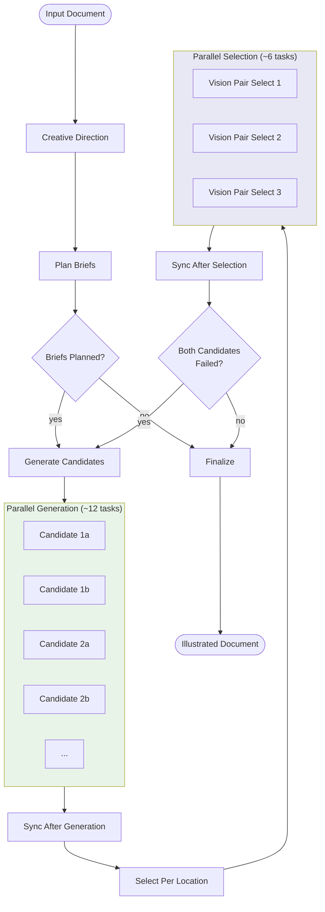

# Illustrate Workflow

Intelligently adds images to markdown documents using three sources: public domain photos, AI-generated images, and SVG diagrams. Uses over-generation with vision pair selection to maximize image quality.

## Usage

```python
from workflows.output.illustrate import illustrate_graph, IllustrateConfig

result = await illustrate_graph.ainvoke({
    "input": {
        "markdown_document": "# My Article\n\nContent here...",
        "title": "My Article",
        "output_dir": "/path/to/images",
    },
    "config": IllustrateConfig(
        additional_image_count=3,
        max_retries=1,
    ),
})

# Access results
illustrated_doc = result["illustrated_document"]
images = result["final_images"]
status = result["status"]  # "success", "partial", or "failed"
```

## Input/Output

| | Format | Description |
|---|--------|-------------|
| **Input** | Markdown | Document content, optional title and output directory |
| **Output** | Markdown | Document with image references inserted below headers |

Additional outputs:
- `final_images`: List of saved images with metadata (path, alt text, attribution)
- `status`: Workflow completion status
- `errors`: List of warnings/errors encountered during generation

## Workflow


```mermaid
flowchart TD
    START([Input Document]) --> P1[Creative Direction]
    P1 --> P2[Plan Briefs]
    P2 --> B{Briefs Planned?}
    B -->|no| F[Finalize]
    B -->|yes| C[Generate Candidates]

    subgraph generation ["Parallel Generation (~12 tasks)"]
        C1[Candidate 1a]
        C2[Candidate 1b]
        C3[Candidate 2a]
        C4[Candidate 2b]
        C5[...]
    end

    C --> generation
    generation --> D[Sync After Generation]

    D --> S[Select Per Location]

    subgraph selection ["Parallel Selection (~6 tasks)"]
        S1[Vision Pair Select 1]
        S2[Vision Pair Select 2]
        S3[Vision Pair Select 3]
    end

    S --> selection
    selection --> SS[Sync After Selection]

    SS --> R{Both Candidates<br/>Failed?}
    R -->|yes| C
    R -->|no| F

    F[Finalize] --> END([Illustrated Document])

    style generation fill:#e8f4e8
    style selection fill:#e8e8f4
```

### Two-Pass Planning

1. **Creative Direction** (Pass 1): Sonnet reads the full document and produces a visual identity (palette, mood, style, avoid-list), an image opportunity map with more locations than needed, and editorial notes on tone and pacing.
2. **Plan Briefs** (Pass 2): Sonnet reads the document again along with the visual identity and selected opportunities from Pass 1. It generates up to 2 candidate briefs per location with concrete image descriptions, search queries, and diagram subtypes.

### Over-Generation + Selection

Each image location gets 2 candidates generated in parallel (~12 total tasks for 6 locations):

1. **Generate Candidates**: Each brief is fulfilled by its planned type (public_domain, diagram, or generated)
2. **Vision Pair Selection**: Sonnet compares the two candidates per location side-by-side and picks the best fit based on the image opportunity's purpose and rationale
3. **Cross-Strategy Retry**: If both candidates for a location fail, a retry round generates new candidates using the alternate image type as fallback (up to `max_retries` rounds)

### Image Types

- **public_domain**: Searches Pexels/Unsplash with LLM-assisted selection
- **diagram**: Generated by Gemini 3 Pro (sharp text, clean layout); `custom_artistic` subtype routes to Imagen
- **generated**: Google Imagen creates images from AI-optimized prompts

## Configuration

| Setting | Default | Description |
|---------|---------|-------------|
| `generate_header_image` | `True` | Whether to create a header image |
| `additional_image_count` | `3` | Number of additional images (0-5) |
| `imagen_sample_count` | `2` | Imagen candidates per call (1-4) |
| `overgeneration_surplus` | `2` | Extra locations beyond target for editorial curation (0-2) |
| `header_prefer_public_domain` | `True` | Try public domain for header first |
| `imagen_aspect_ratio` | `"16:9"` | Aspect ratio for generated images |
| `diagram_width` | `900` | SVG diagram width in pixels |
| `diagram_height` | `600` | SVG diagram height in pixels |
| `max_retries` | `1` | Max retry rounds for failed locations (0-3) |

### Diagram Refinement Settings

| Setting | Default | Description |
|---------|---------|-------------|
| `enable_diagram_refinement` | `True` | Enable iterative quality improvement (legacy SVG pipeline) |
| `diagram_quality_threshold` | `4.7` | Minimum quality score (legacy SVG pipeline) |
| `diagram_max_refinement_iterations` | `3` | Max refinement rounds (legacy SVG pipeline) |
| `enable_editorial_review` | `True` | Enable vision-based editorial curation of surplus images |

### Presets

| Preset | Surplus | Imagen Samples | Editorial Review | Retries |
|--------|---------|----------------|------------------|---------|
| `quick()` | 0 | 1 | Off | 0 |
| `balanced()` | 1 | 2 | On | 1 |
| `quality()` | 2 | 2 | On | 1 |

```python
from workflows.output.illustrate import IllustrateConfig

config = IllustrateConfig.quick()       # ~$0.30/article
config = IllustrateConfig.balanced()    # ~$0.80/article
config = IllustrateConfig.quality()     # ~$1.50/article

# Presets accept overrides
config = IllustrateConfig.quick(additional_image_count=1)
```

## Environment Variables

Requires the following services:
- **Anthropic API**: For Sonnet (creative direction, brief planning, vision selection) and Claude (diagrams)
- **Google Vertex AI**: For Imagen image generation
- **Pexels/Unsplash**: For public domain image search

## Image Attribution

Images are automatically attributed in the markdown output:
- **Public Domain**: "Photo by [photographer] via [source](url)"
- **Diagram**: "Diagram generated by Gemini"
- **Generated**: "Image generated by Imagen"

## Model Usage

| Node | Model | Purpose |
|------|-------|---------|
| creative_direction | Sonnet | Pass 1: visual identity, opportunity map, editorial notes |
| plan_briefs | Sonnet | Pass 2: candidate briefs per image location |
| generate_candidate | Various | Generate image per brief (public domain, Gemini diagram, or Imagen) |
| select_per_location | Sonnet (vision) | Vision pair comparison to pick best candidate |
| editorial_review | Sonnet (vision) | Holistic multi-image curation — cuts surplus from over-generation |

## Related Workflows

- `workflows.output.evening_reads`: Generates illustrated Substack-style articles
- `workflows.shared.diagram_utils`: Standalone diagram generation with refinement
- `workflows.shared.image_utils`: Imagen generation utilities
- `workflows.shared.vision_comparison`: Vision-based image pair selection
- `core.images`: Public domain image search and LLM selection
