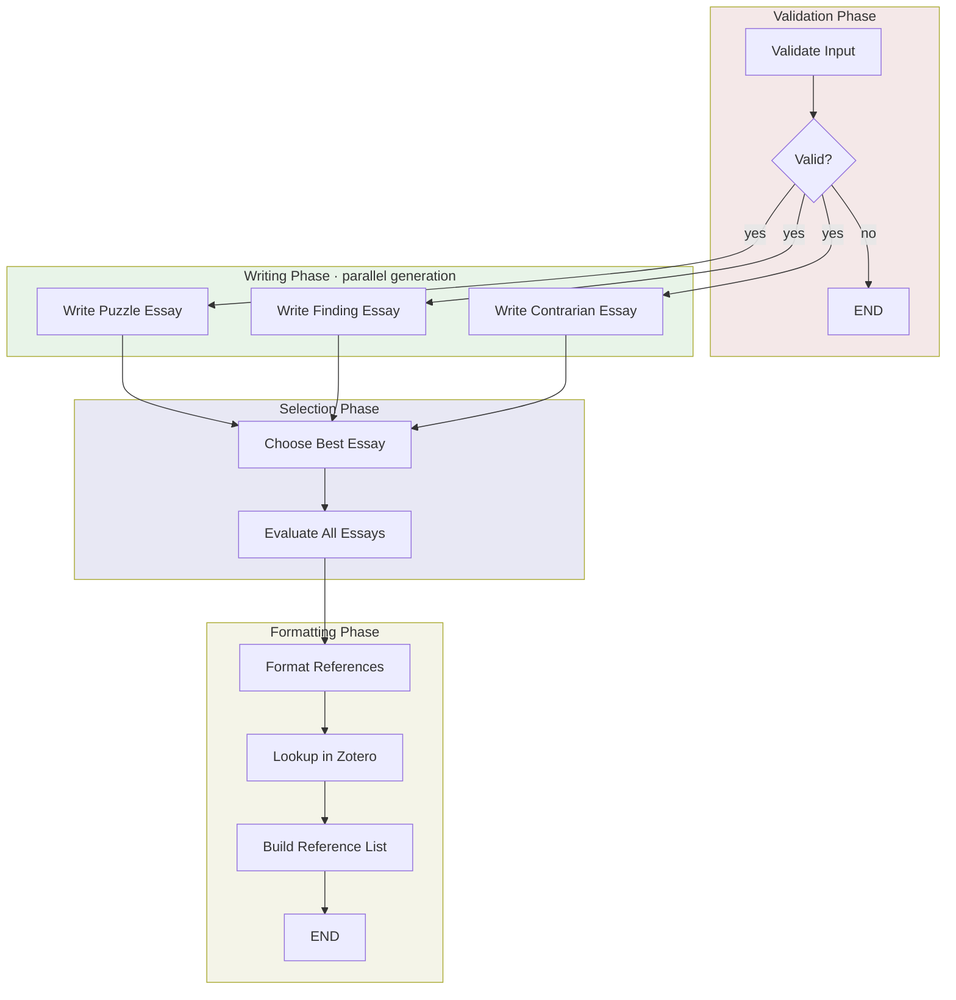

# Substack Review Workflow

Transforms academic literature reviews into engaging Substack-style essays through parallel generation of three distinct narrative angles, structured evaluation, and automated reference formatting via Zotero.

## Usage

```python
from workflows.output.substack_review import substack_review_graph

result = await substack_review_graph.ainvoke({
    "input": {
        "literature_review": "Your literature review markdown here..."
    }
})

# Access the final essay
final_essay = result["final_essay"]

# Check status
if result["status"] == "success":
    print("All references resolved")
elif result["status"] == "partial":
    print(f"Missing references: {result['missing_references']}")

# Access selection reasoning
print(f"Selected angle: {result['selected_angle']}")
print(f"Reasoning: {result['selection_reasoning']}")
```

### Examples

```bash
# Run the test script with a literature review file
python -m testing.test_substack_review

# The test script will:
# - Generate 3 essays in parallel using OPUS
# - Select the best essay
# - Format references from Zotero
# - Write output files with evaluations and all drafts
```

## Input/Output

| | Format | Description |
|---|--------|-------------|
| **Input** | Markdown | Literature review with `[@KEY]` citations (minimum 500 words) |
| **Output** | Markdown | 3,000-4,000 word Substack-style essay with formatted references |

The workflow also returns metadata including the selected angle, evaluation scores for all three essays, selection reasoning, and any missing Zotero references.

## Workflow



### Phase Summary

- **Validation**: Checks minimum word count (500 words), extracts all citation keys from `[@KEY]` format
- **Writing**: Generates three 3,000-4,000 word essays in parallel using OPUS, each with a distinct narrative angle
- **Selection**: Structured evaluation of all three essays using OPUS to select the most engaging one
- **Formatting**: Looks up citations in Zotero, formats them APA-style, appends reference section

## Essay Angles

The workflow generates three distinct essays from the same source material:

| Angle | Approach | Structure |
|-------|----------|-----------|
| **Puzzle** | Narrative Entry Through a Specific Puzzle | Opens with a surprising detail or finding, unfolds as an investigation, surfaces tensions and unresolved questions |
| **Finding** | Lead With the Striking Empirical Finding | Opens with the most surprising quantitative result, explores implications rippling outward, addresses limitations |
| **Contrarian** | Contrarian Framing | Articulates conventional wisdom then reveals complications, explores genuine complexity without oversimplifying |

## Evaluation Criteria

The choosing agent evaluates each essay on six dimensions (1-5 scale):

- **Hook Strength**: Does the opening create genuine curiosity?
- **Structural Momentum**: Does the essay pull the reader forward?
- **Technical Payoff**: Does it deliver genuine insight beyond facts?
- **Tonal Calibration**: Does the voice match the material?
- **Honest Complexity**: Does it acknowledge uncertainty and limitations?
- **Subject-Fit**: Does the chosen angle serve this specific material?

## Citation Handling

- Input citations use `[@KEY]` format (e.g., `[@smith2023]`, `[@jones2024; @lee2025]`)
- Citations are preserved throughout essay generation
- Final output includes APA-style reference list from Zotero lookups
- Status indicates `success` (all found), `partial` (some missing), or `failed`

## Target Reader

The workflow optimizes for a technically sophisticated general audience with:
- Broad knowledge across domains
- Interest in specific details over surface explanations
- Preference for direct, confident writing that acknowledges genuine uncertainty
- Reading for intellectual engagement, not just information transfer
