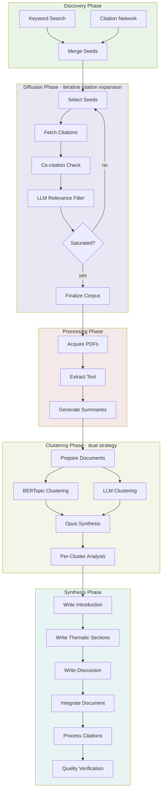

# Academic Literature Review

A multi-stage system for producing comprehensive, PhD-equivalent literature reviews through citation network diffusion, thematic clustering, and structured synthesis.

## Usage

```python
from workflows.research.academic_lit_review import academic_lit_review

result = await academic_lit_review(
    topic="Large Language Models in Scientific Discovery",
    research_questions=[
        "How are LLMs being used for hypothesis generation?",
        "What are the methodological challenges of using LLMs in research?",
    ],
    quality="standard",
    language="en",
    date_range=(2020, 2025),
)

final_review = result["final_report"]
```

### Examples

```bash
# Quick review for exploratory research
python testing/test_academic_lit_review.py "Attention mechanisms" quick

# Standard quality (recommended)
python testing/test_academic_lit_review.py "Transformer architectures" standard

# Comprehensive review for publication
python testing/test_academic_lit_review.py "Vision transformers" comprehensive

# With language option
python testing/test_academic_lit_review.py "Transformer architectures" standard --language es
```

## Input/Output

| | Format | Description |
|---|--------|-------------|
| **Input** | Topic + Questions | Research topic and specific questions to address |
| **Output** | Markdown | Complete literature review with citations and references |

The workflow also returns paper corpus, thematic clusters, quality metrics, and PRISMA documentation for reproducibility.

## Workflow



### Phase Summary

- **Discovery**: Multi-strategy seed discovery via keyword search and initial citation network traversal
- **Diffusion**: Recursive citation network expansion with co-citation filtering and LLM relevance scoring until saturation
- **Processing**: Full-text acquisition via retrieve-academic service, PDF processing, and structured summary extraction
- **Clustering**: Dual-strategy thematic organization using BERTopic statistical clustering and LLM semantic clustering, synthesized by Opus
- **Synthesis**: Thematic section writing with cluster-specific content, integration into coherent document, and citation processing

## Quality Settings

| Setting | test | quick | standard | comprehensive | high_quality |
|---------|------|-------|----------|---------------|--------------|
| Max diffusion stages | 1 | 2 | 3 | 4 | 5 |
| Max papers processed | 5 | 50 | 100 | 200 | 300 |
| Target word count | 2000 | 8000 | 12000 | 17500 | 25000 |
| Min citations filter | 0 | 5 | 10 | 10 | 10 |
| Saturation threshold | 0.50 | 0.15 | 0.12 | 0.10 | 0.10 |
| Recency quota | 0% | 25% | 25% | 25% | 25% |
| Use Batch API | ✓ | ✓ | ✓ | ✓ | ✓ |
| Supervision loops | all | all | all | all | all |

**Recency quota** ensures ~25% of papers come from the past 3 years (if available), balancing seminal works with recent research. Recent papers bypass the citation filter during discovery. The `test` tier disables recency quota for faster iteration.

**Recommended**: Use `quick` for exploratory research, `standard` for most reviews, `comprehensive` or `high_quality` for publication-ready work.

## Architecture

### Discovery Phase
Parallel execution of keyword search (OpenAlex queries) and citation network discovery (forward/backward citations from top seed papers).

### Diffusion Engine
Iterative corpus expansion through citation network traversal with intelligent stopping criteria:
- Co-citation analysis for automatic inclusion of highly co-cited papers
- LLM-based relevance filtering for remaining candidates
- Saturation detection via coverage delta thresholds

### Paper Processing
Three-stage pipeline:
1. PDF acquisition via retrieve-academic service
2. Document processing via document_processing workflow (PDF→Markdown)
3. Structured summary extraction with key findings, methodology, limitations

### Clustering Strategy
Dual-strategy approach synthesized by Opus:
- **BERTopic**: Embedding-based statistical clustering (HDBSCAN) for data-driven themes
- **LLM Clustering**: Semantic clustering via Sonnet 4.5 (1M context) for conceptual themes
- **Opus Synthesis**: Merges both strategies into final ThematicClusters with sub-themes, conflicts, and gaps

### Synthesis Pipeline
Multi-stage document construction:
1. Introduction and methodology sections
2. Thematic sections (one per cluster, written in parallel)
3. Discussion and conclusions
4. Document integration with transitions
5. Citation processing (Pandoc format via Zotero)
6. Quality verification (word count, citation density, coherence)
7. PRISMA documentation generation

## Notes

- This workflow includes supervision loops for iterative quality improvement (configured via `supervision_loops` setting in quality presets).
- Non-English papers require `language` parameter (ISO 639-1 code) for proper processing.
- Full state is saved to workflow state store for downstream use by editing workflows.
