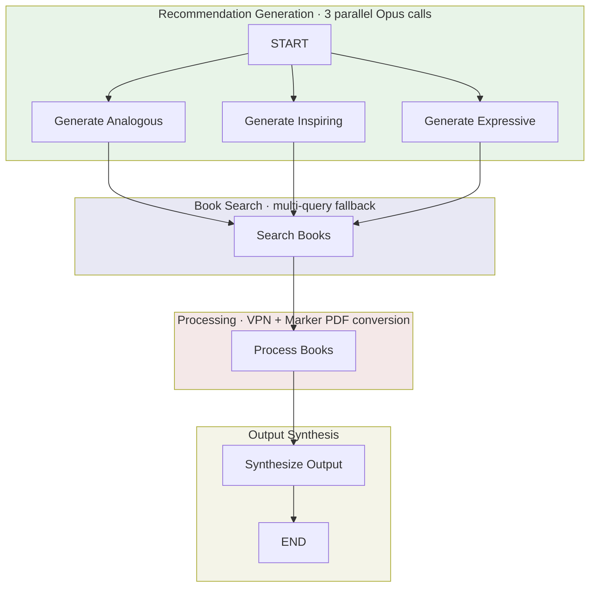

# Book Finding Workflow

A research workflow that discovers books related to a theme across three distinct categories: analogous domain (exploring the theme from different fields), inspiring action (books that inspire change), and expressive fiction (fiction capturing the theme's essence). The workflow generates recommendations via LLM, searches for books via the book_search API, downloads and processes PDFs through Marker, and synthesizes a comprehensive markdown report with theme-relevant summaries.

## Usage

```python
from workflows.research.book_finding import book_finding

result = await book_finding(
    theme="organizational resilience",
    brief="Focus on practical approaches rather than theoretical frameworks",
    quality="standard",
    language="en",
)

report = result["final_report"]
```

### Examples

```bash
# Quick search for testing (2 books per category)
python -m testing.test_book_finding "creative leadership" --quality quick

# Standard quality (recommended, 3 books per category)
python -m testing.test_book_finding "organizational resilience" --quality standard

# Comprehensive search (5 books per category)
python -m testing.test_book_finding "design thinking" --quality comprehensive --brief "Focus on practical applications"

# High quality with Spanish output (7 books per category)
python -m testing.test_book_finding "innovación radical" --quality high_quality --language es
```

## Input/Output

| | Format | Description |
|---|--------|-------------|
| **Input** | `theme: str` | The theme to explore (e.g., "organizational resilience") |
| | `brief: str` (optional) | Additional context to guide recommendations |
| | `quality: str` | Quality tier: test, quick, standard, comprehensive, high_quality |
| | `language: str` | ISO 639-1 language code (default: "en") |
| **Output** | Markdown | Structured report with book recommendations organized by category, including summaries of processed books and unprocessed recommendations |

The workflow returns a dict with `final_report` (markdown), `status` (success/partial/failed), `source_count` (books processed), `errors`, and timing metadata.

## Workflow



### Category Details

- **Analogous Domain**: Books exploring similar themes from different fields, providing unexpected perspectives through cross-disciplinary connections
- **Inspiring Action**: Fiction and nonfiction that inspires action, change, or transformation related to the theme
- **Expressive Fiction**: Fiction that captures the lived experience or potential of the theme—what it feels like or could become

### Processing Pipeline

1. **Recommendation Generation**: Three parallel LLM calls (Opus or Sonnet based on quality) generate book recommendations for each category
2. **Book Search**: Multi-query fallback strategy searches book_search API (title+author, title only, author only) with language filtering and PDF prioritization
3. **Book Processing**: Downloads PDFs via VPN, converts to markdown via Marker, truncates content based on quality settings
4. **Summary Generation**: Sonnet creates theme-relevant summaries for each processed book
5. **Output Synthesis**: Assembles markdown report with processed books (with summaries) and unprocessed recommendations

## Quality Settings

| Setting | test | quick | standard | comprehensive | high_quality |
|---------|------|-------|----------|---------------|--------------|
| Recommendations per category | 1 | 2 | 3 | 5 | 7 |
| Max concurrent downloads | 1 | 2 | 3 | 5 | 7 |
| Max content for summary | 10K | 25K | 50K | 100K | 150K |
| Use Opus for recommendations | ✗ | ✗ | ✓ | ✓ | ✓ |
| Recommendation max tokens | 512 | 1024 | 2048 | 4096 | 8192 |
| Summary max tokens | 256 | 512 | 1024 | 2048 | 4096 |

**Recommended**: Use `quick` for testing themes, `standard` for most research, `comprehensive` or `high_quality` for in-depth exploration requiring more recommendations per category.
