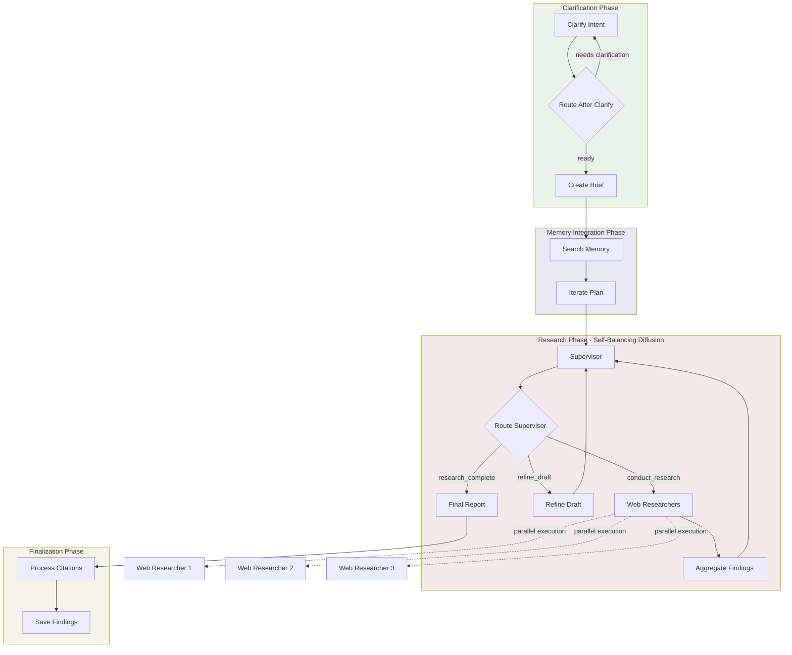

# Web Research Workflow

A comprehensive research workflow that implements a Self-Balancing Diffusion Algorithm for deep research. It searches Thala memory stores first, customizes a research plan based on existing knowledge, coordinates parallel researcher agents, and generates a comprehensive report with citations.

## Usage

```python
from workflows.research.web_research import deep_research

# Standard English research
result = await deep_research(
    query="Impact of AI on software engineering jobs",
    quality="standard",
)

# Research in Spanish (entire workflow runs in Spanish)
result = await deep_research(
    query="impacto de IA en empleos de ingeniería",
    language="es",
)

# High-quality comprehensive research
result = await deep_research(
    query="Quantum computing applications in cryptography",
    quality="comprehensive",
)

final_report = result["final_report"]
print(f"Status: {result['status']}")
print(f"Sources: {result['source_count']}")
```

### Examples

```bash
# Test quality for development
python testing/test_research_workflow.py "climate change impacts" test

# Quick research (2 iterations, ~5 min)
python testing/test_research_workflow.py "renewable energy trends" quick

# Standard research (4 iterations, ~15 min) - recommended
python testing/test_research_workflow.py "AI in healthcare" standard

# Comprehensive research (8 iterations, 30+ min)
python testing/test_research_workflow.py "blockchain scalability" comprehensive

# Research in Japanese
python testing/test_research_workflow.py "人工知能の未来" standard --language ja
```

## Input/Output

| | Format | Description |
|---|--------|-------------|
| **Input** | String | Research query or topic (in any supported language) |
| **Output** | Markdown | Comprehensive research report with citations (in query language) |

The workflow returns a dictionary with:
- `final_report`: Complete markdown report
- `status`: "success", "partial", or "failed"
- `langsmith_run_id`: LangSmith trace ID for debugging
- `errors`: List of any errors encountered
- `source_count`: Number of research findings/sources
- `started_at`: Workflow start timestamp
- `completed_at`: Workflow completion timestamp

## Workflow



### Phase Summary

- **Clarification**: Asks clarifying questions if query is ambiguous or lacks context
- **Memory Integration**: Searches Thala stores for existing knowledge, customizes plan to avoid redundancy
- **Research**: Self-balancing diffusion algorithm coordinates parallel researchers (up to 3 concurrent)
  - Supervisor generates research questions
  - Launches web researchers to investigate
  - Refines draft report with findings
  - Loops until completeness threshold (85%) or max iterations reached
- **Finalization**: Generates final report, processes citations, saves to store

## Quality Settings

| Setting | test | quick | standard | comprehensive | high_quality |
|---------|------|-------|----------|---------------|--------------|
| Max iterations | 1 | 2 | 4 | 8 | 12 |
| Recursion limit | 25 | 50 | 100 | 200 | 300 |
| Duration | ~1 min | ~5 min | ~15 min | 30+ min | 45+ min |
| Completeness threshold | 0.85 | 0.85 | 0.85 | 0.85 | 0.85 |

### Model Tiers by Node

| Node | Model | Purpose |
|------|-------|---------|
| Clarify Intent | DeepSeek V3 | Query disambiguation |
| Create Brief | DeepSeek V3 | Research brief generation |
| Iterate Plan | Opus | Plan customization with memory context |
| Supervisor | Opus | Research coordination and diffusion algorithm |
| Refine Draft | Sonnet | Iterative draft refinement |
| Final Report | Opus | Comprehensive report synthesis |
| Query Generation | DeepSeek V3 | Search query generation |
| Compress Findings | Haiku | Fast finding summarization |
| Citation Metadata | Haiku | Metadata extraction |

**Recommended**: Use `quick` for initial exploration, `standard` for most research, `comprehensive` or `high_quality` for exhaustive deep dives.

## Multi-Language Support

The workflow supports 29 languages with full localization:
- All prompts translated to target language
- Web searches use country-specific domains
- Output report in target language

Supported languages: English (en), Spanish (es), Mandarin Chinese (zh), Japanese (ja), German (de), French (fr), Portuguese (pt), Korean (ko), Russian (ru), Arabic (ar), Italian (it), Dutch (nl), Polish (pl), Turkish (tr), Vietnamese (vi), Thai (th), Indonesian (id), Hindi (hi), Bengali (bn), Swedish (sv), Norwegian (no), Danish (da), Finnish (fi), Czech (cs), Greek (el), Hebrew (he), Ukrainian (uk), Romanian (ro), Hungarian (hu).

## Key Features

### Self-Balancing Diffusion Algorithm
- Iteratively generates research questions and launches parallel researchers
- Tracks completeness score (0-1) based on areas explored vs. remaining
- Auto-completes when 85% threshold reached or max iterations hit
- Dynamic question generation based on current knowledge gaps

### Memory-First Research
- Searches Thala stores before web to leverage existing knowledge
- Customizes research plan to avoid redundancy
- Integrates memory context into research brief

### Parallel Execution
- Up to 3 concurrent web researchers per iteration
- Parallel scraping of top results with TTL cache (1hr)
- Sources: Firecrawl, Perplexity (run in parallel)

### Retry Policies
- Supervisor: 3 attempts with 2.0x backoff
- Final report: 2 attempts with 2.0x backoff
- Process citations: 2 attempts with 2.0x backoff

## Related Workflows

For specialized research needs, use these dedicated workflows:

### Academic Literature Review
```python
from workflows.research.academic_lit_review import academic_lit_review

result = await academic_lit_review(
    topic="machine learning in drug discovery",
    research_questions=["How are GNNs used for molecular property prediction?"],
    quality="standard",
)
```

### Book Finding
```python
from workflows.research.book_finding import book_finding

result = await book_finding(
    theme="organizational resilience",
    brief="Focus on practical approaches",
)
```

## Cleanup

The workflow uses HTTP clients that should be cleaned up after use:

```python
from workflows.research.web_research import cleanup_research_resources

await cleanup_research_resources()
```
