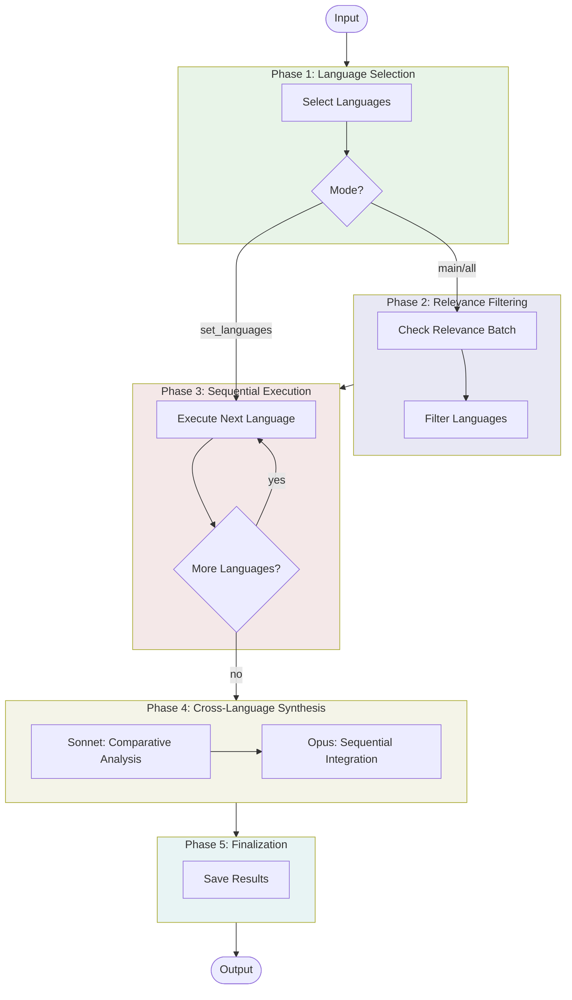

# Multi-Language Research Workflow

A wrapper workflow that orchestrates research across multiple languages with AI-powered relevance filtering, per-language execution, and cross-language synthesis.

## Usage

```python
from workflows.wrappers.multi_lang import multi_lang_research

# Research in specific languages
result = await multi_lang_research(
    topic="sustainable urban planning",
    mode="set_languages",
    languages=["en", "es", "de", "ja"],
    workflow="web",
    quality="standard",
)

# Auto-detect relevant languages from major 10
result = await multi_lang_research(
    topic="traditional medicine practices",
    mode="main_languages",
    workflow="academic",
    research_questions=["What are the historical roots?", "What's the current scientific evidence?"],
)

# Search across all 29 supported languages
result = await multi_lang_research(
    topic="climate policy frameworks",
    mode="all_languages",
    workflow="web",
    quality="quick",
)

# Access results
print(result.final_report)  # Unified English synthesis
print(result.status)  # "success", "partial", or "failed"
print(result.source_count)  # Number of languages researched
```

## Input/Output

| | Format | Description |
|---|--------|-------------|
| **Input** | Parameters | Topic, mode, languages, workflow type, quality tier |
| **Output** | Markdown | Unified English synthesis integrating all language-specific findings |

The workflow returns a `MultiLangResult` with:
- `final_report`: Integrated synthesis in English
- `status`: "success", "partial", or "failed"
- `source_count`: Number of languages successfully researched
- `langsmith_run_id`: For loading detailed state with `load_workflow_state("multi_lang", run_id)`
- `errors`: List of any errors encountered
- `started_at`: Workflow start timestamp
- `completed_at`: Workflow completion timestamp

## Workflow



### Phase Summary

- **Language Selection**: Determines target languages based on mode (set, main 10, or all 29)
- **Relevance Filtering** (modes 2-3): Haiku checks each language for meaningful discussion, filters to relevant subset
- **Sequential Execution**: Runs selected workflow (web/academic/books) for each language sequentially
- **Cross-Language Synthesis**:
  - Sonnet analyzes findings across languages, identifying patterns, differences, and gaps
  - Opus integrates each language's findings sequentially into unified English synthesis
- **Finalization**: Saves per-language results, comparative analysis, and final synthesis to store

## Language Modes

| Mode | Languages | Relevance Check | Use Case |
|------|-----------|-----------------|----------|
| `set_languages` | User-specified | No | Research specific known languages |
| `main_languages` | Major 10 | Yes | Balance coverage and efficiency |
| `all_languages` | All 29 supported | Yes | Comprehensive global coverage |

**Major 10 Languages**: English, Mandarin Chinese, Spanish, German, French, Japanese, Portuguese, Russian, Arabic, Korean

**All 29 Languages**: Major 10 + Italian, Dutch, Polish, Turkish, Vietnamese, Thai, Indonesian, Hindi, Bengali, Swedish, Norwegian, Danish, Finnish, Czech, Greek, Hebrew, Ukrainian, Romanian, Hungarian

## Workflow Types

The workflow can run any registered workflow per language:

### Built-in Workflows

| Key | Name | Description | Requires Questions |
|-----|------|-------------|-------------------|
| `web` | Web Research | Deep web research using search and scraping | No |
| `academic` | Academic Literature Review | Academic paper discovery and synthesis | Yes |
| `books` | Book Finding | Book discovery and recommendation synthesis | No |

### Custom Workflows

Register custom workflows using the workflow registry:

```python
from workflows.wrappers.multi_lang import register_workflow

async def my_workflow_adapter(topic, language_config, quality, research_questions):
    """Adapter must accept these parameters and return WorkflowResult."""
    result = await my_workflow(
        topic=topic,
        language=language_config["code"],
        quality=quality,
    )
    return {
        "final_report": result.get("report"),
        "source_count": result.get("count", 0),
        "status": "completed" if result.get("report") else "failed",
        "errors": result.get("errors", []),
    }

register_workflow(
    key="my_workflow",
    name="My Workflow",
    runner=my_workflow_adapter,
    default_enabled=False,
    requires_questions=True,
    description="Custom research workflow",
)

# Use custom workflow
result = await multi_lang_research(
    topic="topic",
    workflow="my_workflow",
    languages=["en", "es"],
)
```

## Quality Settings

Quality tier is passed through to the underlying workflow (web_research, academic_lit_review, book_finding). Each has its own quality settings.

| Quality | Duration per Language | Description |
|---------|----------------------|-------------|
| `test` | ~1 min | Quick validation and testing |
| `quick` | ~5 min | Fast research for drafts |
| `standard` | ~15 min | Balanced quality (recommended) |
| `comprehensive` | 30+ min | Thorough deep dive |
| `high_quality` | 45+ min | Maximum depth and coverage |

**Note**: Total workflow time = (duration per language × number of languages) + synthesis time

## State Management

The workflow saves comprehensive state for debugging and downstream use:

```python
from workflows.shared.workflow_state_store import load_workflow_state

# Get detailed state
state = load_workflow_state("multi_lang", result.langsmith_run_id)

# Access per-language results
for lang_result in state["language_results"]:
    print(f"{lang_result['language_name']}: {lang_result['source_count']} sources")
    print(lang_result["findings_summary"])

# Access comparative analysis
analysis = state["sonnet_analysis"]
print(analysis["universal_themes"])
print(analysis["regional_variations"])
print(analysis["coverage_gaps_in_english"])

# Access integration steps
for step in state["integration_steps"]:
    print(f"Integrated {step['language_name']}")
    print(step["enhancement_notes"])
```

## Related Workflows

### Individual Language Workflows

For single-language research, use the underlying workflows directly:

```python
# Web research
from workflows.research.web_research import deep_research
result = await deep_research(query="topic", language="es")

# Academic literature review
from workflows.research.academic_lit_review import academic_lit_review
result = await academic_lit_review(topic="topic", language="de")

# Book finding
from workflows.research.book_finding import book_finding
result = await book_finding(theme="topic", language="fr")
```

### Synthesis Wrapper

For comprehensive multi-phase synthesis (academic → supervision → research → synthesis → editing):

```python
from workflows.wrappers.synthesis import synthesis
result = await synthesis(
    topic="AI in healthcare",
    research_questions=["How is AI used?", "What are accuracy rates?"],
    quality="standard",
)
```
