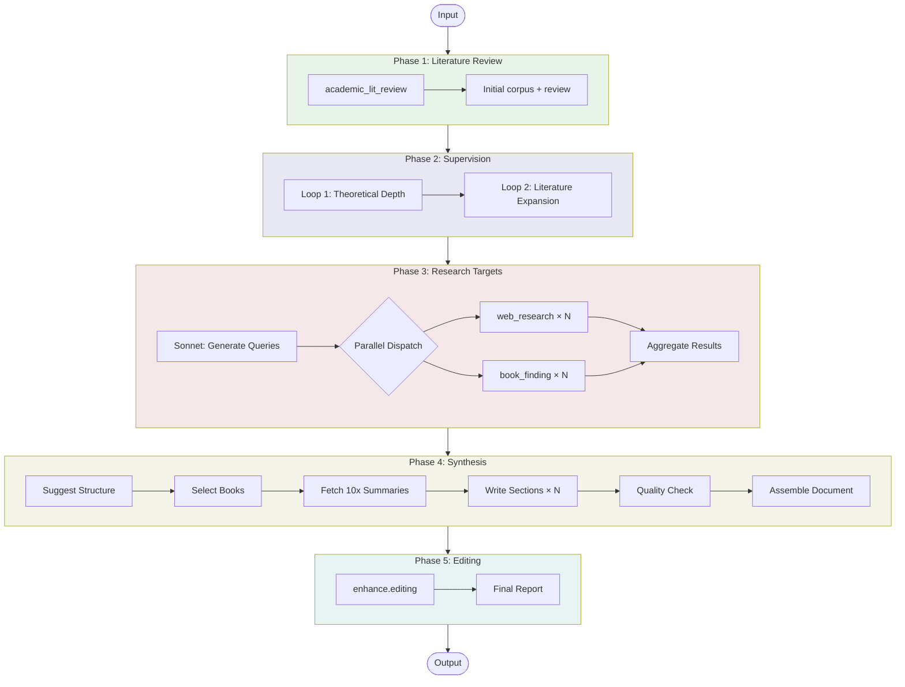

# Synthesis Workflow

A multi-phase workflow that orchestrates academic literature review, supervision, web research, book finding, and editing to create comprehensive synthesized reports on research topics.

## Usage

```python
from workflows.wrappers.synthesis import synthesis

result = await synthesis(
    topic="AI in healthcare diagnostics",
    research_questions=[
        "How is AI being used in medical image analysis?",
        "What are the accuracy rates compared to human clinicians?",
        "What ethical considerations exist for AI diagnosis?",
    ],
    synthesis_brief="Focus on practical applications in resource-limited settings",
    quality="standard",
    language="en",  # Optional: ISO 639-1 code, default "en"
)

# Access results
print(f"Report length: {len(result['final_report'])} chars")
print(f"Status: {result['status']}")
print(f"Sources used: {result['source_count']}")
print(f"Duration: {result['completed_at'] - result['started_at']}")

# Save to file
with open("synthesis.md", "w") as f:
    f.write(result["final_report"])
```

## Input/Output

| | Format | Description |
|---|--------|-------------|
| **Input** | Parameters | Topic, research questions, optional synthesis brief, quality tier, language code |
| **Output** | Markdown | Comprehensive synthesis integrating academic, web, and book sources |

The workflow returns:
- `final_report`: Complete synthesis document with citations
- `status`: "success", "partial", or "failed"
- `source_count`: Total sources integrated (papers + web sources + books)
- `langsmith_run_id`: LangSmith tracing ID
- `errors`: Any errors encountered
- `started_at`: Workflow start timestamp
- `completed_at`: Workflow completion timestamp

## Workflow



### Phase 1: Academic Literature Review

Runs `academic_lit_review` workflow to discover and analyze academic papers on the topic, creating an initial literature review with citations.

### Phase 2: Supervision

Runs `enhance.supervision` to deepen the literature review:
- **Loop 1**: Identifies and fills theoretical gaps
- **Loop 2**: Expands to adjacent literature bases

*Skipped in "test" quality mode.*

### Phase 3: Research Targets & Parallel Research

1. **Generate Targets**: Sonnet analyzes the literature review to identify gaps that need filling through web research and book exploration
2. **Parallel Dispatch**: Runs multiple `web_research` and `book_finding` workers concurrently
3. **Aggregate**: Collects all results for synthesis

### Phase 4: Synthesis

1. **Suggest Structure**: Opus designs the synthesis document structure
2. **Select Books**: Chooses the most valuable books for deep integration
3. **Fetch Summaries**: Retrieves 10:1 summaries from Elasticsearch store
4. **Write Sections**: Parallel workers write each section with proper citations
5. **Quality Check**: Evaluates each section against quality thresholds
6. **Assemble**: Combines sections into the final document

*In "test" mode, uses simplified single-pass synthesis instead.*

### Phase 5: Editing

Runs `enhance.editing` to polish the final document, improving transitions, coherence, and prose quality.

## Quality Settings

| Setting | test | quick | standard | comprehensive | high_quality |
|---------|------|-------|----------|---------------|--------------|
| Skip supervision | ✓ | ✗ | ✗ | ✗ | ✗ |
| web_research runs | 1 | 2 | 3 | 4 | 5 |
| book_finding runs | 1 | 2 | 3 | 4 | 5 |
| Simple synthesis | ✓ | ✗ | ✗ | ✗ | ✗ |
| Max books selected | 2 | 3 | 4 | 5 | 6 |
| Target word count | 3,000 | 12,000 | 18,000 | 26,250 | 37,500 |
| Opus for structure | ✗ | ✓ | ✓ | ✓ | ✓ |
| Opus for sections | ✗ | ✗ | ✓ | ✓ | ✓ |
| Section quality threshold | 0.5 | 0.6 | 0.7 | 0.75 | 0.8 |

**Recommended**:
- `test`: Quick iteration and testing
- `quick`: Fast synthesis for drafts
- `standard`: Balanced quality for most use cases
- `comprehensive`/`high_quality`: When thorough coverage is critical

## Citation Format

The synthesis uses `[@ZOTKEY]` citations throughout, which can be resolved against Zotero for bibliography generation. All sources (academic papers, web pages, books) are added to Zotero during processing.

## Dependencies

This workflow orchestrates:
- `workflows.research.academic_lit_review`
- `workflows.enhance.supervision`
- `workflows.research.web_research`
- `workflows.research.book_finding`
- `workflows.enhance.editing`
